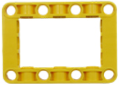
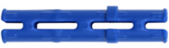
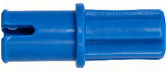
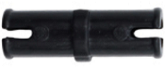
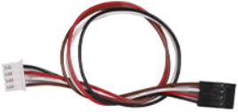
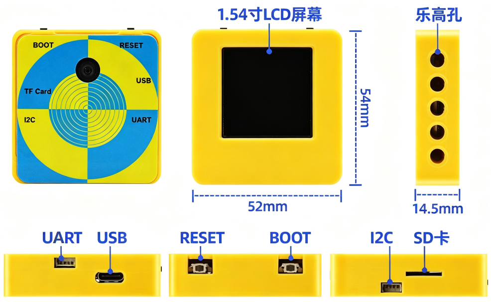
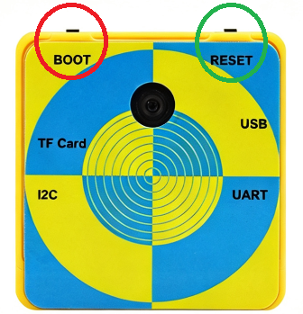

# **1. 产品介绍**

## 1.1 产品安全

1\. 本产品内含排针针脚，注意刺伤，请勿让7岁以下的儿童接触，放在他们拿不到的地方。
2\. 本产品包含导电部件(控制板和电子模块），请按照本教程的要求进行操作，不当的操作可能导致过热并且损害零件，请勿触摸并立即断开电路电源。

## 1.2 产品简介

**视觉AI摄像头控制+语音控制扩展包** 是专为 4WD 麦克纳姆轮小车设计的增强功能模块。添加该扩展包后，您可通过视觉AI摄像头控制4WD 麦克纳姆轮小车，并实时读取卡片数据，同步显示至控制终端。语音控制功能支持自定义唤醒词（例如“小智小智”），可通过语音指令实现4WD 麦克纳姆轮小车控制。本扩展包配套课程，专门适配 Arduino 4WD 麦克纳姆轮小车套件，提供针对性的教学与实践指导。

## 1.2 产品清单

| 序号 |     名称     |    数量    |       图片       |
| ---- | ------------------ | ---- | ------------------ |
| 1  | 语音识别模块          | 1 |  |
| 2  | 视觉AI摄像头模块扩展包 | 1 |  |
| 3  | 32524 1*7梁 黄色 | 1 |  |
| 4  | 32316 1*5梁 黄色 | 1    |   |
| 5  | 64179 5*7方形异形梁 黄色 | 1 |  |
| 6  | 6558 1*3摩擦销 蓝色  | 1 |  |
| 7  | 43093 半十字轴栓 摩擦面 蓝色  | 1  |  |
| 8  | 2780 标准栓 黑色 | 1 |  |
| 9  | 4265c 十字轴套圆形 黄色 | 1 |  |
| 10 | XH-2.54mm 4P转杜邦母连拼（黑红白棕）| 1  |  |  

## 1.3 模块介绍

### 1.3.1 语音识别模块

语音识别模块，使用MUS516P6为主控芯片，是一款低功耗、小体积、功能强大的离线语音识别模组，能快速应用于智能家居，各类智能小家电，86 盒，玩具，灯具等需要语音操控的产品。

如果你想更深入的了解语音识别模块，请进入相关链接：[语音识别模块 — keyestudio WiKi 文档](https://www.keyesrobot.cn/projects/KE4084/zh-cn/latest/)

### 1.3.2 视觉AI摄像头模块

视觉AI摄像头模块是一款面向中小学人工智能教育的图像识别设备，完美兼容乐高积木结构与Arduino生态。使用ESP32S3为处理器，内部集成多种离线识别算法（颜色识别，二维码识别，交通卡片识别，人脸检测）。通过软件串口与主控板通讯可以根据自己需要变更引脚。视觉AI摄像头模块机身配有一块全视角1.54寸高清LCD屏幕，可实时显示图像画面以及识别结果，便于使用和调试。通过即插即用式硬件接口以及开源项目，学生可快速搭建视觉驱动的小车、智能家居等智能项目，是培养AI思维与工程能力的理想教具。

**组件介绍：**

 

**参数：**

| 项目         | 单位 | 参数       | 备注                                         |
| ------------ | :--: | ---------- | -------------------------------------------- |
| 输入电压     |  V   | 3.3-5.0    | 超出此范围，可能导致设备工作异常或损坏       |
| 工作电流     |  mA  | 110@5V     | 5V 供电                                      |
| IO电平       |  V   | 3.3        | IO电平与输入电压一致。无法适配1.8V的主控设备 |
| 尺寸         |  mm  | 54x52x14.5 | 外壳边缘尺寸，按键略高于壳体                 |
| 重量         |  g   | 35.5       |                                              |
| 摄像头类型   |  /   | CMOS       |                                              |
| 摄像头分辨率 | 像素 | 200W       |                                              |
| 镜头视场角   |  度  | 100        |                                              |
| 屏幕尺寸     |  寸  | 1.54       | 指画面斜对角，240x240分辨率                  |
| 按键         |  个  | 2          | BOOT按键、RESET按键                          |
| 通讯接口     |  个  | 2          | PH2.0-4pin接口                               |
| 通讯方式     |  /   | UART、I2C  | 支持UART串口和I2C方式                        |
| 定位孔数量   |  个  | 5          | 分布在外壳正反面、两侧及底部                 |
| 定位孔中心距 |  mm  | 16、32     |                                              |
| 定位孔直径   |  mm  | 4          | 兼容乐高机械组类型的积木                     |

**按键功能说明：**

通过按`BOOT`键实现模式的转换；按`RESET`键实现复位。

**特点：**

乐高生态融合：模块化卡扣设计，直接嵌入乐高机械结构。

4种识别功能：颜色识别，卡片识别，人脸识别，二维码识别。

如果你想更深入的了解视觉AI摄像头模块，请进入相关链接：[视觉AI摄像头模块 — keyestudio WiKi 文档](https://www.keyesrobot.cn/projects/KE4084/zh-cn/latest/)

