### 3.1 语音控制小车组装

**1\. 所需零件**

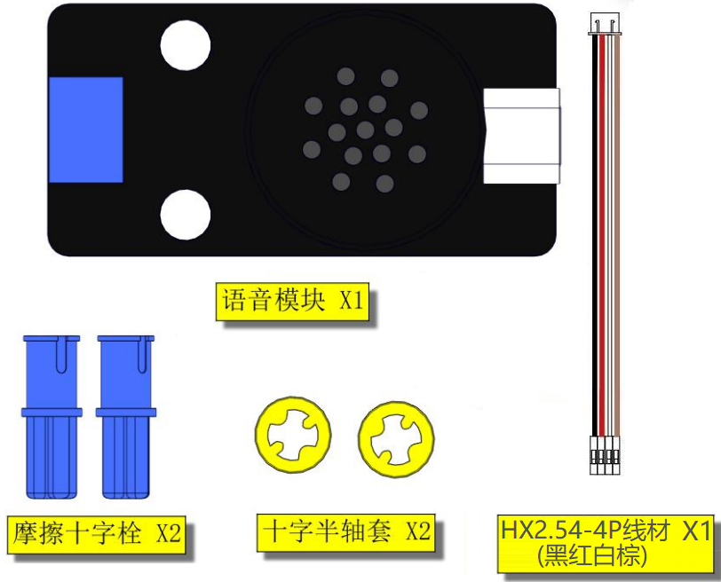

**2\. 将4P线材的一端安装到语音识别模块上**

⚠️ **特别提醒：接线时，请注意区分线材颜色、端口正反面，请勿反插，否则会损坏端口。线材的一头端口与语音识别模块连接，另一头端口再接到扩展板上。后面安装过程中，4P线材不能从语音识别模块上拔下来！！**

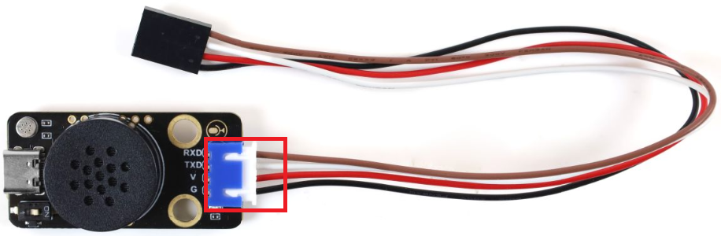

**3\. 安装**

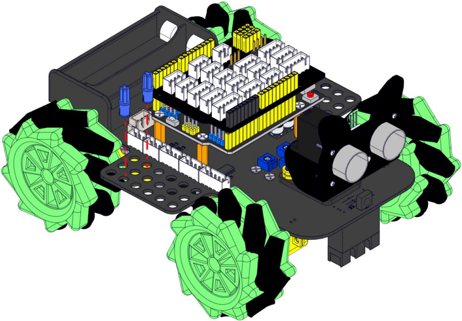

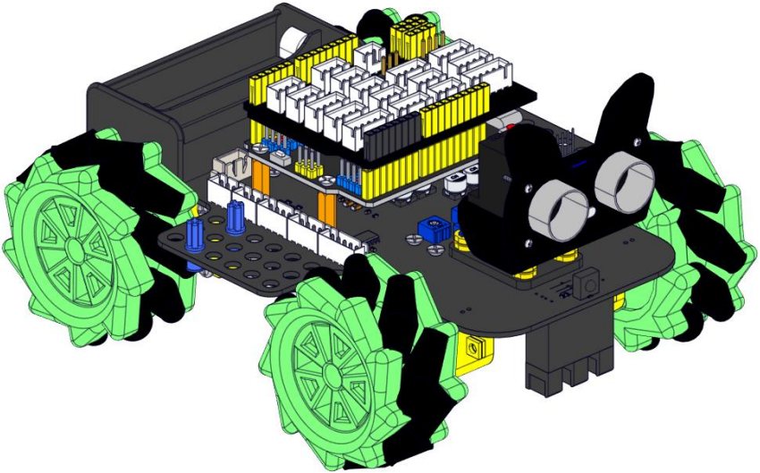

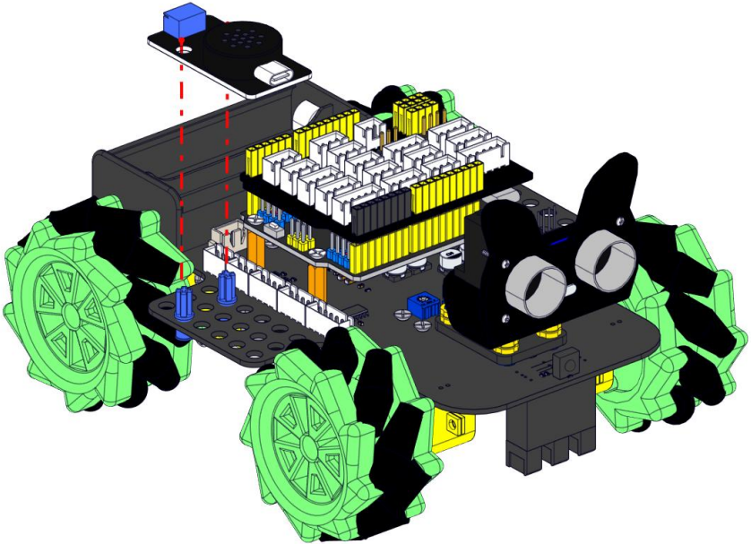

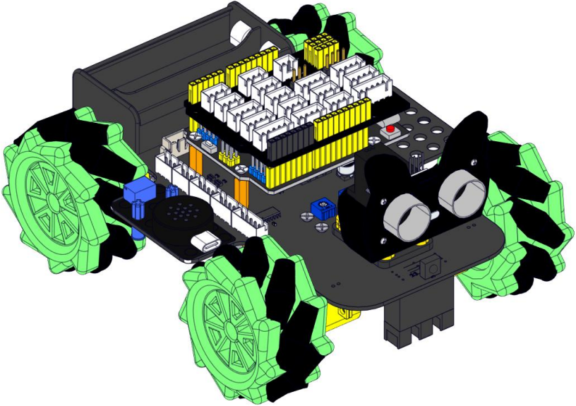

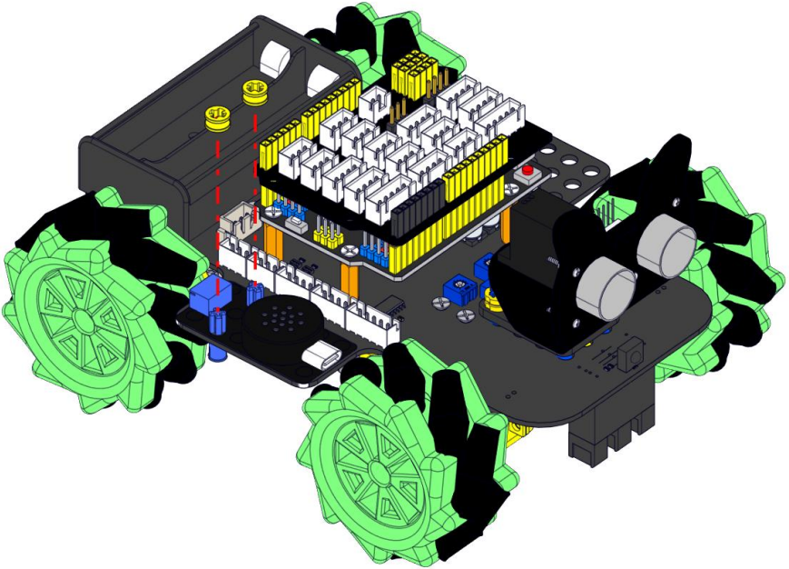

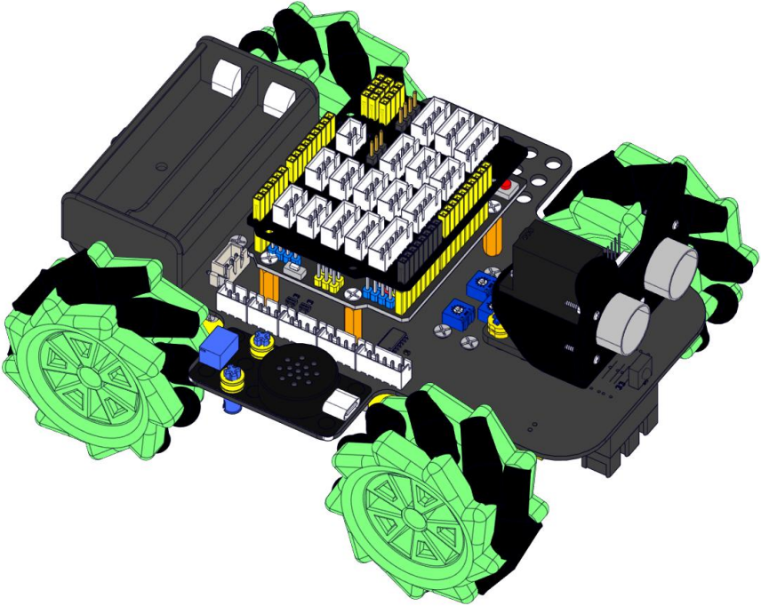

**4\. 接线**

⚠️ **特别提醒：将语音识别模块接入扩展板时，请注意区分线材的颜色。G通过黑线接G，V通过红线接V，TXD通过白线接A4，RXD通过棕线接A5。**

| 语音模块 | 线材颜色 |扩展板 | 
| :---: |  :---: |:---: |
| **G** | 黑线 | G | 
| **V** | 红线 | 5V |  
| **TXD** | 白线 | A4 |
| **RXD** | 棕线 | A5 |

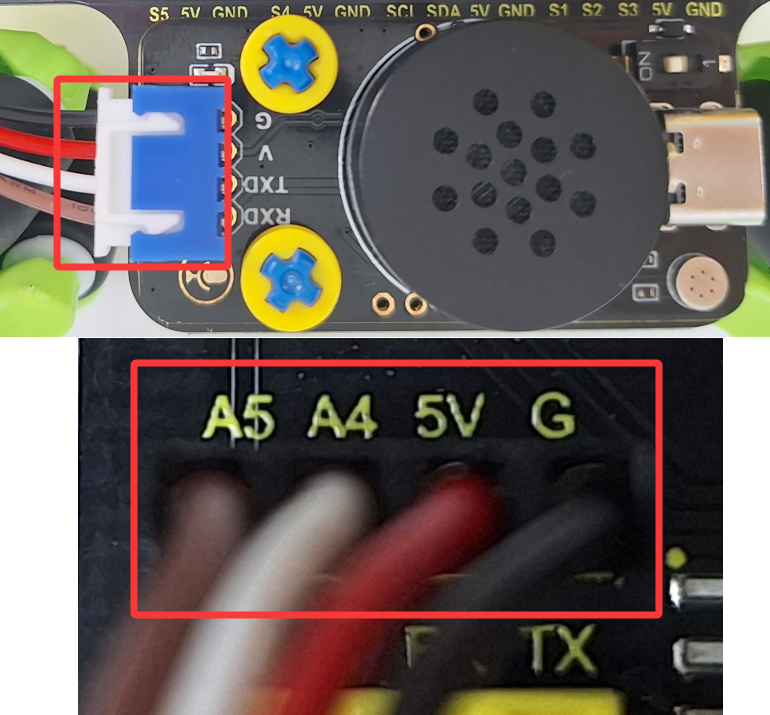

**5\. 安装电池**

⚠️ **特别注意：安装电池时，需要注意电池的正负极，千万不能安装反，否则会烧坏电池和小车。**

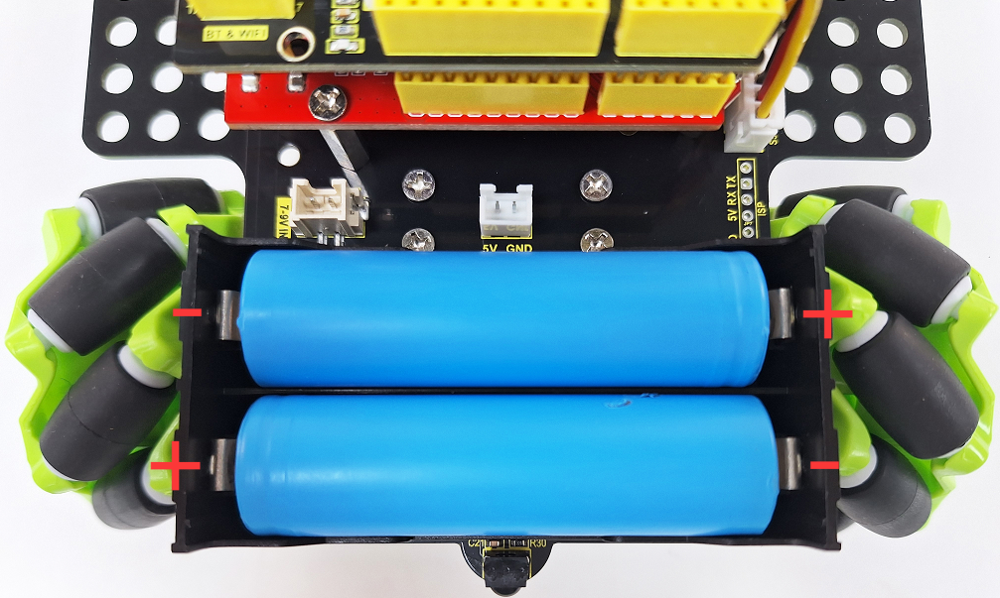

**6\. 整体效果图**

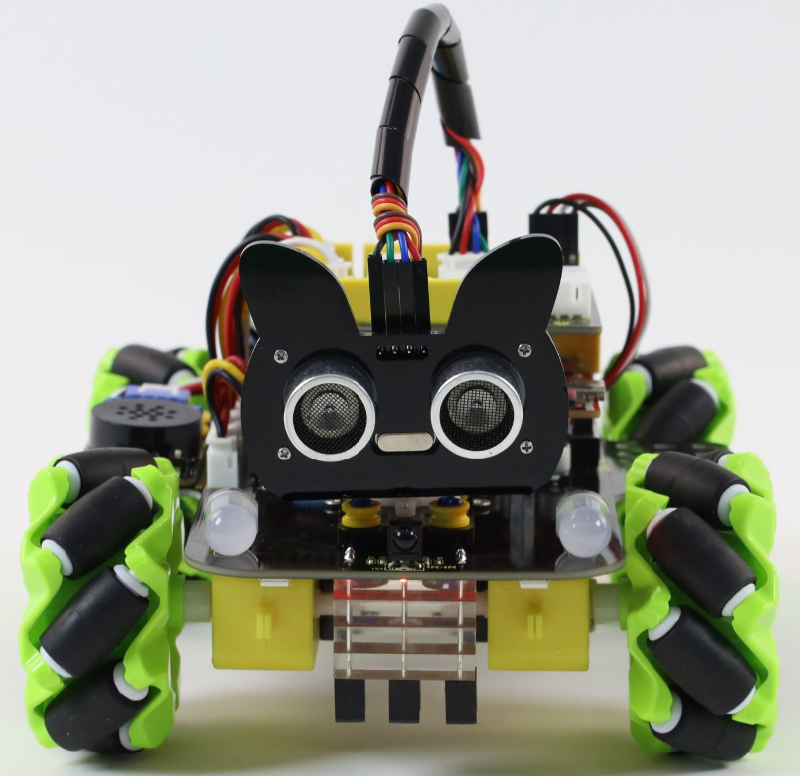
