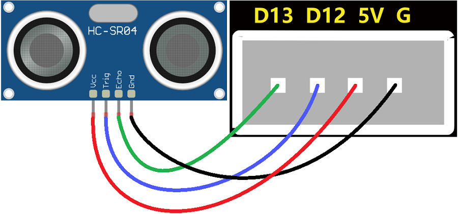

### 第5课 语音播报距离

#### 5.1 课程介绍

想象一下，如果我们的智能车拥有一双“眼睛”，能看清前方的路况，并且还能像副驾驶一样实时向你汇报：“当前距离为XX厘米！”那该多酷？这就是我们今天要实现的“语音擂报距离”功能。

在之前的课程中，我们已经学会了如何让小车“听懂”指令（语音识别）和如何控制灯光、舵机。但那些都是单向的控制。今天，我们要让小车具备“感知”能力。我们将使用超声波传感器来测量距离，它就像蝙蝠一样，发出人耳听不见的声波，通过计算回声返回的时间来判断物体的远近。同时，结合智能语音识别模块，我们将把冷冰冰的数字变成生动的语音播报。

学完这节课，你不仅掌握了超声波测距的核心原理，还学会了如何将传感器数据与智能语音识别模块联动。这是制作避障机器人、自动泊车系统甚至智能盲杖的基础技能。准备好了吗？让我们给小车装上“眼睛”和“嘴巴”！

#### 5.2 实验组件

| 元件名称 | 数量 | 图片 |
| :---: | :---: | :---: |
| 组装好的4WD麦克纳姆轮智能小车<br>(<span style="color: rgb(255, 76, 65);">未插上蓝牙模块</span>) | 1 |  |
| 智能语音识别模块             | 1    |  |
|HX2.54-4P 线材 (黑红白棕) |   1    |  |
| USB线     | 1    |   |
| 18650电池 | 2 |  |

#### 5.3 接线图

⚠️ 特别注意：4WD麦克纳姆轮智能小车已经组装好了，这里不需要把超声波传感器拆下来又重新组装和接线，这里再次提供接线图，是为了方便您编写代码！但是，智能语音识别模块是需要你自己接线的。

| 语音识别模块 | 扩展板 | 
| :---: | :---: |
| **GND** | G | 
| **V** | 5V | 
| **TXD** | A4 |
| **RXD** | A5 |


| 超声波传感器 | 扩展板 | 
| :---: | :---: |
| **Vcc** | 5V | 
| **Trig** | D12 |
| **Echo** | D13 |
| **Gnd** | G |




#### 5.4 实验代码

⚠️ <span style="color:red;">**特别提醒：语音控制 4WD 麦克纳姆轮小车已经组装好了。由于不需要用到蓝牙模块，那么在上传代码之前，请务必拔掉蓝牙模块。因为蓝牙模块也占用Arduino的串口通信（TX/RX），如果不拔掉，代码上传会失败！！**</span>

```cpp
// 导入相关库文件
#include <SoftwareSerial.h>

/*******超声波传感器接口*****/
const int TrigPin = 12; // Trig接D12
const int EchoPin = 13; // Echo接D13

/*******智能语音识别模块接口*****/
const int RX_PIN = A5; // 引脚 A5 为 RX
const int TX_PIN = A4; // 引脚 A4 为 TX
SoftwareSerial mySerial(RX_PIN, TX_PIN); // 定义软件串口引脚（RX, TX）

// 定义变量用于存储从语音模块接收到的控制码
volatile int Voice_Control = 0;  // 初始化为0，确保首次判断时不触发任何指令
// 定义变量用于存储从超声波传感器检测到的距离
volatile int distance = 0;
volatile int duration = 0;

// 串口发送消息最大长度
#define UART_SEND_MAX      32
#define UART_MSG_HEAD_LEN  2
#define UART_MSG_FOOT_LEN  2
// 串口发送消息号
#define U_MSG_bozhensgshu      1
#define U_MSG_boxiaoshu      2
#define U_MSG_bobao1      3
#define U_MSG_bobao2      4
#define U_MSG_bobao3      5
#define U_MSG_bobao4      6
#define U_MSG_bobao5      7
#define U_MSG_bobao6      8
#define U_MSG_bobao7      9
#define U_MSG_bobao8      10
#define U_MSG_bobao9      11
#define U_MSG_bobao10      12
#define U_MSG_bobao11      13
#define U_MSG_bobao12      14
#define U_MSG_bobao13      15
#define U_MSG_bobao14      16
#define U_MSG_bobao15      17
#define U_MSG_bobao16      18
#define U_MSG_bobao17      19
#define U_MSG_bobao18      20
#define U_MSG_bobao19      21
#define U_MSG_bobao20      22
#define U_MSG_bobao21      23

// 串口消息参数类型
typedef union {
  double d_double;
  int d_int;
  unsigned char d_ucs[8];
  char d_char;
  unsigned char d_uchar;
  unsigned long d_long;
  short d_short;
  float d_float;}uart_param_t;

// 串口发送函数实现
void _uart_send_impl(unsigned char* buff, int len) {
  // TODO: 调用项目实际的串口发送函数
  for(int i=0;i<len;i++){
    mySerial.write (*buff++);
  }
}

// 串口通信消息尾
const unsigned char g_uart_send_foot[] = {
  0x55, 0xaa
};

// 十六位整数转32位整数
void _int16_to_int32(uart_param_t* param) {
  if (sizeof(int) >= 4)
    return;
  unsigned long value = param->d_long;
  unsigned long sign = (value >> 15) & 1;
  unsigned long v = value;
  if (sign)
    v = 0xFFFF0000 | value;
  uart_param_t p;  p.d_long = v;
  param->d_ucs[0] = p.d_ucs[0];
  param->d_ucs[1] = p.d_ucs[1];
  param->d_ucs[2] = p.d_ucs[2];
  param->d_ucs[3] = p.d_ucs[3];
}

// 浮点数转双精度
void _float_to_double(uart_param_t* param) {
  if (sizeof(int) >= 4)
    return;
  unsigned long value = param->d_long;
  unsigned long sign = value >> 31;
  unsigned long M = value & 0x007FFFFF;
  unsigned long e =  ((value >> 23 ) & 0xFF) - 127 + 1023;
  uart_param_t p0, p1;
  p1.d_long = ((sign & 1) << 31) | ((e & 0x7FF) << 20) | (M >> 3);
  param->d_ucs[0] = p0.d_ucs[0];
  param->d_ucs[1] = p0.d_ucs[1];
  param->d_ucs[2] = p0.d_ucs[2];
  param->d_ucs[3] = p0.d_ucs[3];
  param->d_ucs[4] = p1.d_ucs[0];
  param->d_ucs[5] = p1.d_ucs[1];
  param->d_ucs[6] = p1.d_ucs[2];
  param->d_ucs[7] = p1.d_ucs[3];
}

// 串口通信消息头
const unsigned char g_uart_send_head[] = {
  0xaa, 0x55
};

// 把获取超声波检测的距离，写在一个函数里
float getDistance() {
  digitalWrite(TrigPin,LOW);
  delayMicroseconds(2);
  digitalWrite(TrigPin,HIGH);
  delayMicroseconds(10);	// 给Trig至少10us的高电平时间触发
  digitalWrite(TrigPin,LOW);
  duration = pulseIn(EchoPin,HIGH);	// Echo高电平的时间
  distance = duration/58;		// 换算成距离，单位为cm
  delay(50);  
  return distance;
}

// 播报函数9
void _uart_bobao9() {
  uart_param_t param;
    int i = 0;
    unsigned char buff[UART_SEND_MAX] = {0};
    for (i = 0; i < UART_MSG_HEAD_LEN; i++) {
        buff[i + 0] = g_uart_send_head[i];
    }
    buff[2] = U_MSG_bobao9;
    for (i = 0; i < UART_MSG_FOOT_LEN; i++) {
        buff[i + 3] = g_uart_send_foot[i];
    }
    _uart_send_impl(buff, 5);
}

// 播报整数
void _uart_bozhensgshu(int zhengshu) {
  uart_param_t param;
    int i = 0;
    unsigned char buff[UART_SEND_MAX] = {0};
    for (i = 0; i < UART_MSG_HEAD_LEN; i++) {
        buff[i + 0] = g_uart_send_head[i];
    }
    buff[2] = U_MSG_bozhensgshu;
    param.d_int = zhengshu;
    _int16_to_int32(&param);
    buff[3] = param.d_ucs[0];
    buff[4] = param.d_ucs[1];
    buff[5] = 0;
    buff[6] = 0;
    for (i = 0; i < UART_MSG_FOOT_LEN; i++) {
        buff[i + 7] = g_uart_send_foot[i];
    }
    _uart_send_impl(buff, 9);
}

// 播报函数16
void _uart_bobao16() {
  uart_param_t param;
    int i = 0;
    unsigned char buff[UART_SEND_MAX] = {0};
    for (i = 0; i < UART_MSG_HEAD_LEN; i++) {
        buff[i + 0] = g_uart_send_head[i];
    }
    buff[2] = U_MSG_bobao16;
    for (i = 0; i < UART_MSG_FOOT_LEN; i++) {
        buff[i + 3] = g_uart_send_foot[i];
    }
    _uart_send_impl(buff, 5);
}

void setup(){
   Serial.begin(9600);  // 硬件串口（与电脑通信）
   mySerial.begin(9600);  // 软件串口（与外设通信）
   pinMode(TrigPin,OUTPUT);  // Trig设置为输出模式
   pinMode(EchoPin,INPUT);   // Echo设置为输入模式
}

void loop(){
   distance = getDistance(); // 超声波传感器读取距离
   if (mySerial.available() > 0) {  // 接收语音控制模块的外设数据(命令参数)
     Voice_Control = mySerial.read(); // 将接收到的外设数据(命令参数)进行赋值 
     Serial.println(Voice_Control); // 串口打印收到的外设数据(命令参数)
   }  
   if (Voice_Control == 54) { // 进行判断，接收到的外设数据(命令参数)为54，检测距离并且进行语音播报
      delay(2000);
      _uart_bobao9();
      delay(2000);
      _uart_bozhensgshu(distance);
      delay(2000);
      _uart_bobao16();
      delay(1000);
   }
   // 清除指令，避免重复执行
   Voice_Control = 0;
}
```

#### 5.5 代码解释

1\. 触发超声波

```cpp
digitalWrite(trigPin, LOW);
delayMicroseconds(2);
digitalWrite(trigPin, HIGH);
delayMicroseconds(10);
digitalWrite(trigPin, LOW);
```

- 这是 HC-SR04 的标准触发时序。必须先拉低，再拉高至少 10 微秒，再拉低。
- `delayMicroseconds()` 比 `delay()` 更精确，适合微秒级的操作。如果高电平时间不够 10us，传感器可能不会发射声波。

2\. 读取与计算距离

```cpp
duration = pulseIn(EchoPin,HIGH);	
distance = duration/58;	
delay(50);	
```

3\. 语音播报逻辑

```cpp
distance = getDistance();
if (mySerial.available() > 0) {   
   Voice_Control = mySerial.read(); 
   Serial.println(Voice_Control);  
}  
if (Voice_Control == 54) { 
  delay(2000);
  _uart_bobao9();
  delay(2000);
  _uart_bozhensgshu(distance);
  delay(1000);
  _uart_bobao16();
   delay(2000); 
}
```
- 超声波传感器检测距离，语音识别模块接收到对应的语音指令，语音播报超声波传感器检测到的距离。


#### 5.6 实验结果

⚠️ <span style="color:red;">**重要提示：由于不需要用到蓝牙模块，那么在上传代码之前，请务必拔掉蓝牙模块。因为蓝牙模块也占用Arduino的串口通信（TX/RX），如果不拔掉，代码上传会失败！！**</span>

外接电源，将电机驱动板上的拨码开关拨到 “<span style="color: rgb(255, 76, 65);">ON</span>” 端，上电后。选择好正确的开发板板型（Arduino Uno）和 适当的串口端口（COMxx），然后单击  按钮上传代码至Arduino控制板。

代码上传成功后，然后对着语音识别模块上的麦克风，使用唤醒词 “你好，小智” 或 “小智小智” 来唤醒语音识别模块，同时喇叭播放回复语 “有什么可以帮到您”；

语音识别模块唤醒后，对着麦克风说：“现在距离是多少” 等命令词时，接着语音播报 “正在为您读取距离” + “当前距离为” + “超声波传感器检测到的距离数值” + “厘米”。

