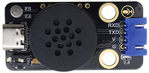
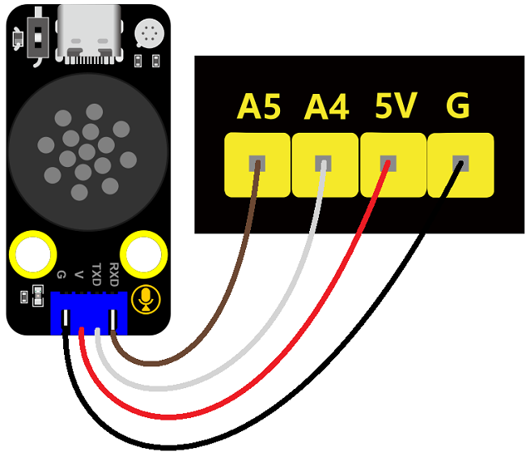

### 第6课 语音控制智能车运动

#### 6.1 课程介绍

想象一下，你不需要任何遥控器，只需对着空气说一声“前进”，你的小车就会乖乖地向前跑去；说一声“左转”，它就会灵活地原地旋转。这听起来像科幻电影里的场景，但在今天的课程中，我们将亲手实现它。语音控制不仅仅是智能家居的专利，在机器人领域，它能让交互变得更加自然和直观。

在前几节课中，我们已经学会了如何让语音识别模块识别指令，并点亮七彩灯或驱动舵机转动。今天，我们要挑战更复杂的任务：控制一辆4WD麦克纳姆轮智能小车，根据语音指令实现小车前进、后退、左转、右转和停止等动作。


#### 6.2 实验组件

| 元件名称 | 数量 | 图片 |
| :---: | :---: | :---: |
| 组装好的4WD麦克纳姆轮智能小车<br>(<span style="color: rgb(255, 76, 65);">未插上蓝牙模块</span>) | 1 |  |
| 语音识别模块             | 1    |  |
|HX2.54-4P 线材 (黑红白棕)|   1    |  |
| USB线     | 1    |   |
| 18650电池 | 2 |  |

#### 6.3 接线图

⚠️ 特别注意：4WD Arduino麦克纳姆轮智能小车已经组装好了，这里不需要把控制4个电机的接线拆下来又接线，这里再次提供接线图，是为了方便您编写代码！但是，语音识别模块是需要你自己接线的。

| 智能语音识别模块 | 扩展板 | 
| :---: | :---: |
| **GND** | G | 
| **V** | 5V | 
| **TXD** | A4 |
| **RXD** | A5 |



| 七彩灯与4个电机 | 扩展板 | 
| :---: | :---: |
| **GND** | D4 | 
| **5V** | D5 |
| **SDA** | D3 |
| **SCL** | D2 |


#### 6.4 实验代码

⚠️ <span style="color:red;">**特别提醒：语音控制 4WD 麦克纳姆轮小车已经组装好了。由于不需要用到蓝牙模块，那么在上传代码之前，请务必拔掉蓝牙模块。因为蓝牙模块也占用Arduino的串口通信（TX/RX），如果不拔掉，代码上传会失败！！**</span>

```cpp
// 导入相关库文件
#include <SoftwareSerial.h>
#include "MecanumCar_v2.h"
#include "Servo.h"
#include <Adafruit_NeoPixel.h>
#ifdef __AVR__
 #include <avr/power.h> // 需要 16 MHz Adafruit 固件
#endif

/*******智能语音识别模块接口*****/
const int RX_PIN = A5; // 引脚 A5 为 RX
const int TX_PIN = A4; // 引脚 A4 为 TX
SoftwareSerial mySerial(RX_PIN, TX_PIN); // 定义软件串口引脚（RX, TX）

/*******4颗WS2812全彩灯珠接口与灯珠数量*****/
const int LED_PIN = 10;  // 4颗WS2812全彩灯珠引脚
const int LED_COUNT = 4; // 新像素数
Adafruit_NeoPixel strip(LED_COUNT, LED_PIN, NEO_GRB + NEO_KHZ800);

/*******七彩灯与4个电机接口*****/
mecanumCar mecanumCar(3, 2);  // sda-->D3,scl-->D2

/*******舵机接口*****/
const int SERVO_PIN = 9;  // 舵机信号引脚
Servo myservo;    // 定义一个舵机类实例

// 定义变量用于存储从语音模块接收到的控制码
volatile int Voice_Control = 0;  // 初始化为0，确保首次判断时不触发任何指令

void setup() {
  Serial.begin(9600);  // 硬件串口（与电脑通信）
  mySerial.begin(9600);  // 软件串口（与外设通信）
  myservo.attach(SERVO_PIN);  // 将D9上的舵机附加到舵机对象上
  myservo.write(90); // 转动到90度
  delay(300);  // 延时0.3秒
  mecanumCar.Init(); // 初始化七彩灯与电机驱动
  mecanumCar.Stop(); // 小车停止
  #if defined(__AVR_ATtiny85__) && (F_CPU == 16000000)
    clock_prescale_set(clock_div_1);
  #endif
  strip.begin();  // 初始化新像素条
  strip.show();  // 关闭所有像素
  strip.setBrightness(100); // 设置亮度（最大255）
  colorWipe(strip.Color(0, 0, 0), 50);
}

void loop() {
  if (mySerial.available()) {  // 检查软串口是否有来自语音模块的数据可读
     Voice_Control = mySerial.read();  // 从软串口读取多个字节的数据      
     Serial.println(Voice_Control);  // 将接收到的数据通过硬件串口输出到串口监视器，便于调试
  }
  if (Voice_Control == 25) {  // 根据接收到的指令值25，执行相应操作
    mecanumCar.Advance(); // 小车前进
    colorWipe(strip.Color(255, 0, 0), 50); // 打开红灯
  } else if (Voice_Control == 26) {  // 根据接收到的指令值26，执行相应操作
    mecanumCar.Back(); // 小车后退
    colorWipe(strip.Color(0, 255, 0), 50); // 打开绿灯
  } else if (Voice_Control == 27) {  // 根据接收到的指令值27，执行相应操作
    mecanumCar.Turn_Left(); // 小车左转
    colorWipe(strip.Color(0, 0, 255), 50); // 打开蓝灯
  } else if (Voice_Control == 28) {  // 根据接收到的指令值28，执行相应操作
    mecanumCar.Turn_Right(); // 小车右转
    colorWipe(strip.Color(0, 0, 255), 50); // 打开黄灯
  } else if (Voice_Control == 33) {  // 根据接收到的指令值33，执行相应操作
    mecanumCar.Stop(); // 停止
    colorWipe(strip.Color(0, 0, 0), 50);  // 关闭灯
  }
  // 清除指令，避免重复执行
  Voice_Control = 0;
}

// 用一种颜色填充灯带
void colorWipe(uint32_t color, int wait) {
  for(int i=0; i<strip.numPixels(); i++) { 
    strip.setPixelColor(i, color); // 设置像素颜色
    strip.show();  // 更新灯带
    delay(wait);   // 暂停
  }
}
```

#### 6.5 代码解释

**1\. 引脚定义与常量**

```cpp
const int RX_PIN = A5; 
const int TX_PIN = A4;
mecanumCar mecanumCar(3, 2); 
const int SERVO_PIN = 9;  
```
- 我们将引脚号定义为常量，方便修改。

**2\. Setup 初始化**

```cpp
Serial.begin(9600);  
mySerial.begin(9600);  
myservo.attach(SERVO_PIN); 
myservo.write(90); 
delay(300);
mecanumCar.Init(); 
mecanumCar.Stop(); 
```
- `Serial.begin(9600)` 启动串口通信，速率必须与语音识别模块一致（默认为 9600）。
- `myservo.write(90)` 设定舵机初始角度。
- `mecanumCar.Init()` 初始化七彩灯与电机驱动。
- `mecanumCar.Stop()` 确保上电瞬间小车不会乱动，保证安全。

**3\. Loop()中的指令解析**

```cpp
if (mySerial.available()) {  
   Voice_Control = mySerial.read();      
   Serial.println(Voice_Control);  
}
```
- `Serial.available()` 检查串口缓冲区是否有数据。如果有，`mySerial.read()` 读取一个字节。然后串口打印。

```cpp
if (Voice_Control == 25) {  
   mecanumCar.Advance();
   colorWipe(strip.Color(255, 0, 0), 50);
} else if (Voice_Control == 26) {  
   mecanumCar.Back();
   colorWipe(strip.Color(0, 255, 0), 50);
} else if (Voice_Control == 27) { 
   mecanumCar.Turn_Left();
   colorWipe(strip.Color(0, 0, 255), 50);
} else if (Voice_Control == 28) {  
  mecanumCar.Turn_Right();
  colorWipe(strip.Color(0, 0, 255), 50);
} else if (Voice_Control == 33) {  
  mecanumCar.Stop();
  colorWipe(strip.Color(0, 0, 0), 50);
}
```
- 通过对应语音指令来控制小车执行“前进”、“后退”、“左转”、“右转”、“停止”等动作，同时4颗WS2812灯珠会亮对应颜色灯。

#### 6.6 实验结果

⚠️ <span style="color:red;">**重要提示：由于不需要用到蓝牙模块，那么在上传代码之前，请务必拔掉蓝牙模块。因为蓝牙模块也占用Arduino的串口通信（TX/RX），如果不拔掉，代码上传会失败！！**</span>

外接电源，将电机驱动板上的拨码开关拨到 “<span style="color: rgb(255, 76, 65);">ON</span>” 端，上电后。选择好正确的开发板板型（Arduino Uno）和 适当的串口端口（COMxx），然后单击  按钮上传代码至Arduino控制板。

代码上传成功后，然后对着语音识别模块上的麦克风，使用唤醒词 “你好，小智” 或 “小智小智” 来唤醒语音识别模块，同时喇叭播放回复语 “有什么可以帮到您”；

语音识别模块唤醒后，对着麦克风说：“前进” 等命令词时，喇叭播放对应的回复语 “正在前进”，同时小车前进，4颗WS2812灯珠亮红色灯；

对着麦克风说：“后退” 等命令词时，喇叭播放对应的回复语 “正在后退”，同时小车后退，4颗WS2812灯珠亮绿色灯；

对着麦克风说：“左转” 等命令词时，喇叭播放对应的回复语 “正在左转”，同时小车左转，4颗WS2812灯珠亮蓝色灯；

对着麦克风说：“右转” 等命令词时，喇叭播放对应的回复语 “正在右转”，同时小车右转，4颗WS2812灯珠亮黄色灯；

对着麦克风说：“停止” 等命令词时，喇叭播放对应的回复语 “已停止”，同时小车停止，4颗WS2812灯珠不亮。


