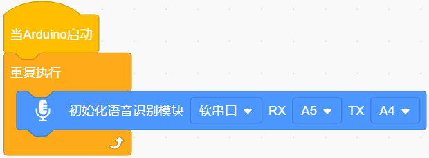
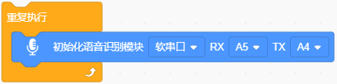
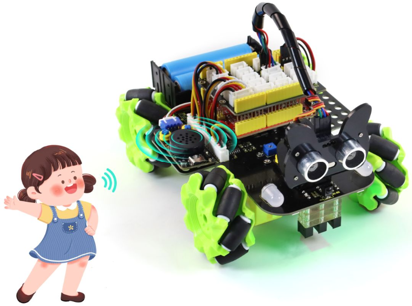
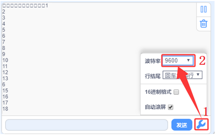

### 第1课 语音控制基础教程

#### 1.1 课程介绍

使用语音模块，烧录我们自定义的语音固件，通过唤醒词"你好，小智"或"小智小智"来唤醒语音模块并使用语音命令词进行控制它通过串口发送指令给智能小车上的Arduino开发板。   

#### 1.2 语音固件命令

**语音识别指令：**

命令码：收到命令词后语音模块通过串口输出的命令字符，通过这个命令字符就能判断需要执行什么功能。

命令词：人对着语音模块说话的词语，如：“开灯” 就是在告诉语音模块我需要开灯，它就会发送指定的命令码到开发板中，开发板通过对指令码进行判断从而实现控制LED灯点亮。

命令回复：告诉你，你的命令已经执行完毕。

| 命令码 | 命令词 | 命令回复语 |
| :--: | :--: | :--: |
| 1  | "打开台灯" 或 "请开灯" 或 "开灯" 或 "打开灯" 或 "我回来了" |已为您打开照明|
| 2  |"关闭台灯" 或 "请关灯" 或 "关灯" 或 "睡觉了" 或 "关上灯" 或 "我出去了"|已为您关闭照明|
| 3  |"调亮一点" 或 "亮一点"|灯光已调亮|
| 4  |"调暗一点" 或 "暗一点"|灯光已调暗|
| 5  |"打开风扇" 或 "请开风扇" 或 "开风扇"|已为您打开风扇|
| 6  |"关闭风扇" 或 "请关风扇" 或 "关风扇" 或 "关上风扇"|已为您关闭风扇|
| 7  |"风大一点" 或 "大一点"|风速已增加|
| 8  |"风小一点" 或 "小一点"|风速已减弱|
| 9  |"浇水" 或 "请浇水"|已开始浇水|
| 10 |"停止浇水" 或 "请停止浇水"|已停止浇水|
| 11 |播放音乐|已为您播放音乐|
| 12 |关闭音乐|已为您停止音乐|
| 13 |打开红灯|已为您打开红灯|
| 14 |关闭红灯|已为您关闭红灯|
| 15 |打开绿灯|已为您打开绿灯|
| 16 |关闭绿灯|已为您关闭绿灯|
| 17 |打开蓝灯|已为您打开蓝灯|
| 18 |关闭蓝灯|已为您关闭蓝灯|
| 19 |打开点阵|已为您打开点阵|
| 20 |关闭点阵|已为您关闭点阵|
| 21 |"有人" 或 "有人靠近" 或 "有人过来"|是,有人正过来|
| 22 |"无人" 或 "人远离"|是,没有人|
| 23 |下雨|正在下雨|
| 24 |"停雨" 或 "雨停了"|雨停了|
| 25 |前进|正在前进|
| 26 |后退|正在后退|
| 27 |左转|正在左转|
| 28 |右转|正在右转|
| 29 |循迹|循迹模式开启|
| 30 |跟随|跟随模式开启|
| 31 |避障|避障模式开启|
| 32 |寻光|寻光模式开启|
| 33 |停止|已停止|
| 34 |开始喂食 或 喂食|已开始喂食|
| 35 |停止喂食|已停止喂食|
| 36 |打开彩灯|已为您打开彩灯|
| 37 |关闭彩灯|已为您关闭彩灯|
| 38 |"打开蜂鸣器" 或 "蜂鸣器开始鸣叫"|已打开蜂鸣器|
| 39 |"关闭蜂鸣器" 或 "蜂鸣器停止鸣叫"|已关闭蜂鸣器|
| 40 |增大音量|已增大音量|
| 41 |减小音量|已减小音量|
| 42 |最大音量|已调到最大音量|
| 43 |中等音量|已调到中等音量|
| 44 |最小音量|已调到最小音量|
| 45 |舵机角度增大|舵机角度已增大|
| 46 |舵机角度减少|舵机角度已减少|
| 47 |"当前温度是多少" 或 "当前温度多少"|正在为您读取温度|
| 48 |"当前湿度是多少" 或 "当前湿度多少"|正在为您读取湿度|
| 49 |"当前雨水量是多少" 或 "当前雨量多少"|正在为您读取当前雨水量|
| 50 |"当前光照强度是多少" 或 "光照强度多少" |正在为您读取光照强度|
| 51 |"当前土壤湿度是多少" 或 "土壤湿度多少"|正在为您读取土壤湿度|
| 52 |"当前水位是多少" 或 "水位多少"|正在为您读入水位|
| 53 |"几点了" 或 "现在几点了"|正在为您读取时间|
| 54 |现在距离是多少|正在为您读取距离|
| 55 |开机|已开机 |
| 56 |关机|已关机 |
| 57 |"开窗" 或 "打开窗户"|已为您打开窗户|
| 58 |"关窗" 或 "关闭窗户" |已为您关闭窗户|
| 59 |"开门" 或 "打开门"|已为您打开门|
| 60 |"关门" 或 "关闭门"|已为您关闭门|
| 61 |"升旗" 或 "旗子上升"|已为您升旗|
| 62 |"降旗" 或 "降旗"|已为您降旗|
| 63 |"开窗帘" 或 "打开窗帘" |已为您打开窗帘|
| 64 |"关窗帘" 或 "关闭窗帘" |已为您关闭窗帘|
| 65 |"当前总挥发性有机物浓度是多少" |正在为您读取总挥发性有机物浓度|
| 66 |"当前二氧化碳浓度是多少" |正在为您读取二氧化碳浓度|
| 67 |"当前空气质量指数是多少" |正在为您读取空气质量指数|

**语音播报指令：**

消息号：消息号是开发板通过串口发送给语音模块的指令，语音模块接收到消息号后就会播报对应的语音。

语音播报：收到消息号后播报的语音，双引号 “xxxx” 中的是数据的名称，如：当前雨水量为百分之“二十”，当前温度是“二十六”度。

| 消息号 | 播报指令 |
| :--: | :--: |
| 1  |当前温度为|
| 2  |度|
| 3  |当前雨水量为百分之|
| 4  |当前湿度为百分之|
| 5  |当前光照强度为|
| 6  |当前土壤湿度为百分之|
| 7  |当前水位为|
| 8  |现在是北京时间|
| 9  |当前距离为|
| 10 |点|
| 11 |分|
| 12 |秒|
| 13 |点整|
| 14 |毫升|
| 15 |毫米|
| 16 |厘米|
| 17 |米|
| 18 |千米|
| 19 |当前总挥发性有机物浓度为十亿分之|
| 20 |当前二氧化碳浓度为百万分之|
| 21 |当前空气质量指数为|

#### 1.3 实验组件

| 名称                     | 数量 | 图片                          |
| ------------------------ | ---- | ----------------------------- |
| 组装好的语音控制智能小车 (未插上蓝牙模块) | 1 |  |
| USB线     | 1    |   |
| 18650电池 | 2 |  |

#### 1.4 接线图

⚠️ **特别注意：语音控制智能小车已经组装好了，这里不需要把语音模块的线材拆下来又重新接线。这里再次提供接线图，是为了方便您编写代码**。

| 语音模块 | 扩展板 | 
| :---: | :---: |
| **G** | G | 
| **V** | 5V | 
| **TXD** | A4 |
| **RXD** | A5 |

#### 1.5 实验代码

⚠️ **特别提醒：语音控制智能小车已经组装好了。由于不需要用到蓝牙模块，那么在上传代码之前，请务必拔掉蓝牙模块。因为蓝牙模块也占用Arduino的串口通信（TX/RX），如果不拔掉，代码上传会失败！！**

#### 1.6 代码说明

- 初始化语音模块的软串口、引脚；

- 重复接收语音指令、读取语音指令且串口打印语音指令等参数。

#### 1.7 实验结果

⚠️ **重要提示：由于不需要用到蓝牙模块，那么在上传代码之前，请务必拔掉蓝牙模块。因为蓝牙模块也占用Arduino的串口通信（TX/RX），如果不拔掉，代码上传会失败！！**

外接电源，将电机驱动板上的拨码开关拨到 “ON” 端，上电后。选择好正确的设备（Mecanum Robot）和 适当的串口端口（COMxx），然后单击按钮上传代码至Arduino控制板。代码上传成功后，单击KidsBlock IDE右下角的，设置串口波特率为 `9600`。

对着语音模块上的麦克风，使用唤醒词 “你好，小智” 或 “小智小智” 来唤醒语音模块，同时喇叭播放回复语 “有什么可以帮到您”；接下来即可通过串口打印窗口查看语音模块接收到语音命令词所对应的命令码 等。

语音模块唤醒后，对着麦克风说：“打开台灯” 或 “请开灯” 或 “开灯” 或 “打开灯” 或 “我回来了”等命令词时，串口打印命令参数 “1”，同时喇叭播放对应的回复语 “已为您打开照明”。

对着麦克风说：“关闭台灯” 或 “请关灯” 或 “关灯” 或 “睡觉了” 或 “关上灯” 或 “我出去了”等命令词时，串口打印命令参数 “2”，同时喇叭播放对应的回复语 “已为您关闭照明”。

对着麦克风说：“调亮一点” 或 “亮一点” 等命令词时，串口打印命令参数 “3”，同时喇叭播放对应的回复语 “灯光已调亮”。

对着麦克风说 “调暗一点” 或 “暗一点”等命令词时，串口打印命令参数 “4”，同时喇叭播放对应的回复语 “灯光已调暗”。

其他的这里就不一一分别陈述，请查看上面所列的语音识别指令和语音播报指令，所对应的命令码和信息号。

