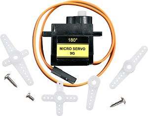
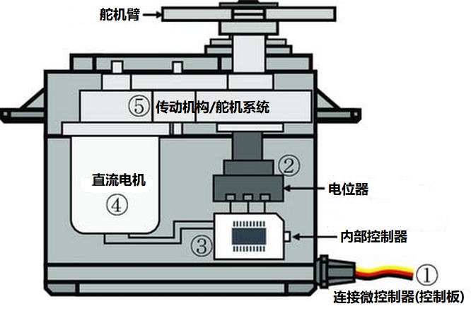
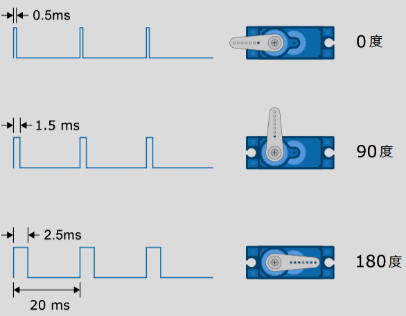
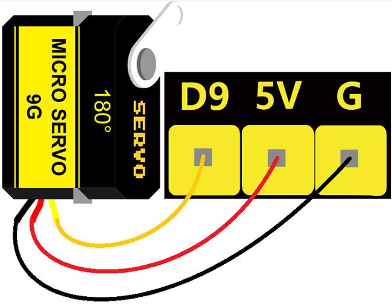
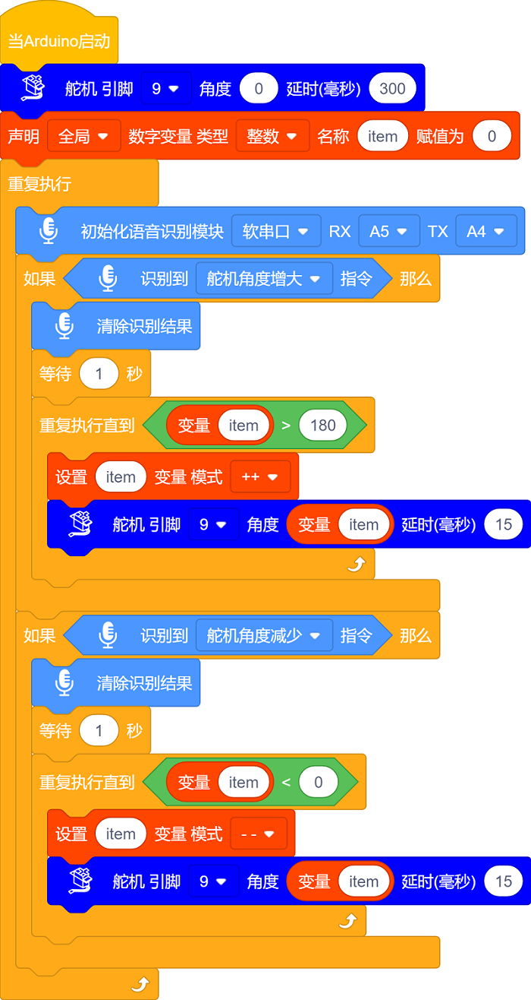
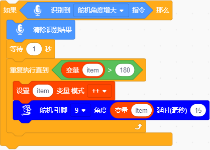
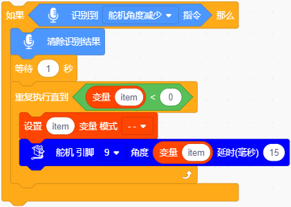

### 第4课 语音控制舵机

#### 4.1 课程介绍

在之前的课程中，我们已经学会了如何用语音控制灯光的颜色和亮度。但智能车不仅仅是发光，它还需要“动”起来。想象一下，当你喊出“开门”时，车门自动打开；或者喊出“抓取”时，机械臂伸出夹住物体。这些动作的核心执行元件就是**舵机（Servo）**。

舵机是一种位置伺服的驱动器，它能精确地旋转到指定的角度并保持住，这与普通电机一直旋转不同。在本课中，我们将结合之前学过的语音识别模块，让 Arduino 主控板接收语音指令，然后驱动一个 180° 舵机转动。

学完这节课，你将掌握舵机的工作原理、如何使用 Arduino 自带的 Servo 库进行控制，以及如何将语音信号转化为具体的机械动作。这是让你的智能车从 “静态展示” 走向 “动态交互” 的关键一步。

#### 4.2 元件知识

舵机内部主要由直流电机、减速齿轮组、电位器和控制电路组成。你可以把它想象成一个带有“记忆”的电机。

**内部结构图：**

**引脚介绍：**

**棕线：** 一个接地的引脚

**红线：** 一个连接到+5V电源的引脚

**橙线：** 信号端的引脚，PWM信号控制

当我们给舵机发送一个 PWM（脉冲宽度调制）信号时，控制电路会检测这个信号的脉冲宽度。标准的舵机信号周期是 20ms（即频率 50Hz）。在这个周期内，高电平持续的时间决定了舵机的角度：

- **0.5ms** 的高电平通常对应 **0°**。
- **1.5ms** 的高电平通常对应 **90°**（中位）。
- **2.5ms** 的高电平通常对应 **180°**。

Arduino 的 `Servo` 库帮我们要处理这些复杂的时序计算，我们只需要告诉它角度（0-180），它会自动生成对应的 PWM 信号。

#### 4.3 实验组件

| 元件名称 | 数量 | 图片 |
| :---: | :---: | :---: |
| 组装好的4WD麦克纳姆轮智能小车 (未插上蓝牙模块) | 1 |  |
| 语音识别模块             | 1    |  |
|HX2.54-4P 线材 (黑红白棕)|   1    |  |
| 18650电池 | 2 |  |
| Type-C USB线             | 1    |   |

#### 4.4 接线图

⚠️ 特别注意：4WD麦克纳姆轮智能小车已经组装好了，这里不需要把舵机拆下来又重新组装和接线，这里再次提供接线图，是为了方便您编写代码！但是，语音识别模块是需要你自己接线的。

| 智能语音识别模块 |扩展板 | 
| :---: | :---: |
| **GND** | G | 
| **V** | 5V | 
| **TXD** | A4 |
| **RXD** | A5 |

| 舵机 | 扩展板 | 
| :---: | :---: |
| **棕线** | G | 
| **红线** | 5V | 
| **橙线** | D9 |

#### 4.5 实验代码

⚠️ **特别提醒：语音控制 4WD 麦克纳姆轮小车已经组装好了。由于不需要用到蓝牙模块，那么在上传代码之前，请务必拔掉蓝牙模块。因为蓝牙模块也占用Arduino的串口通信（TX/RX），如果不拔掉，代码上传会失败！！**

#### 4.6 代码解释

- 初始化舵机角度为0；

- 定义变量 “item” 来储存舵机角度，初始值为0。

- 当语音识别模块接收到 “舵机角度增大” 等命令词时，舵机从0°缓慢地转动到180°。

- 当语音识别模块接收到 “舵机角度减少” 等命令词时，舵机从180°缓慢地转动到0°。

#### 4.7 实验现象

⚠️ **重要提示：由于不需要用到蓝牙模块，那么在上传代码之前，请务必拔掉蓝牙模块。因为蓝牙模块也占用Arduino的串口通信（TX/RX），如果不拔掉，代码上传会失败！！**

外接电源，将电机驱动板上的拨码开关拨到 “ON” 端，上电后。选择好正确的设备（Mecanum Robot）和 适当的串口端口（COMxx），然后单击按钮上传代码至Arduino控制板。

代码上传成功后，然后对着智能语音模块上的麦克风，使用唤醒词 “你好，小智” 或 “小智小智” 来唤醒智能语音模块，同时喇叭播放回复语 “有什么可以帮到您”；

语音识别模块唤醒后，对着麦克风说：“舵机角度增大” 等命令词时，喇叭播放对应的回复语 “舵机角度已增大”，同时舵机从0°缓慢地转到180°位置；

对着麦克风说：“舵机角度减少” 等命令词时，喇叭播放对应的回复语 “舵机角度已减少”，同时舵机从180°缓慢地转到0°位置。

