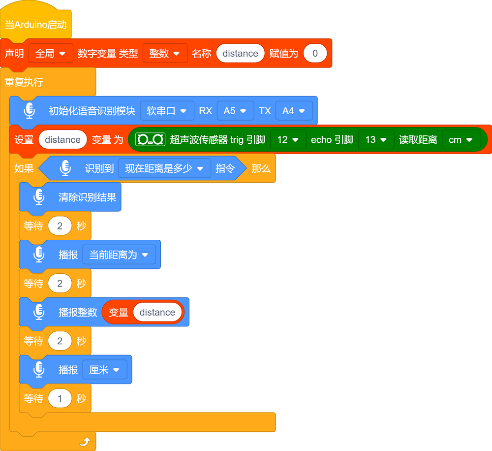
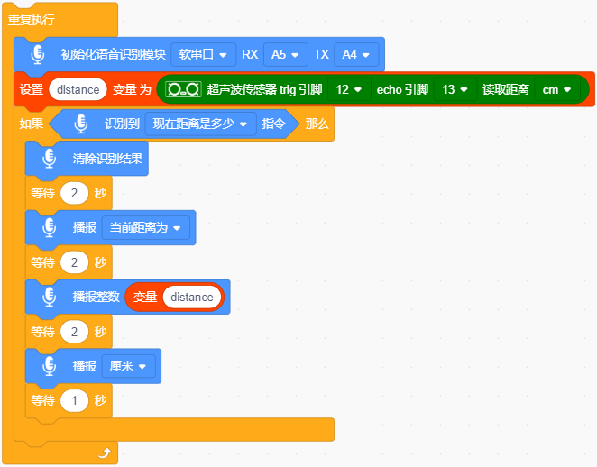

### 第5课 语音播报距离

#### 5.1 课程介绍

想象一下，如果我们的智能车拥有一双“眼睛”，能看清前方的路况，并且还能像副驾驶一样实时向你汇报：“当前距离为XX厘米！”那该多酷？这就是我们今天要实现的“语音擂报距离”功能。

在之前的课程中，我们已经学会了如何让小车“听懂”指令（语音识别）和如何控制灯光、舵机。但那些都是单向的控制。今天，我们要让小车具备“感知”能力。我们将使用超声波传感器来测量距离，它就像蝙蝠一样，发出人耳听不见的声波，通过计算回声返回的时间来判断物体的远近。同时，结合智能语音识别模块，我们将把冷冰冰的数字变成生动的语音播报。

学完这节课，你不仅掌握了超声波测距的核心原理，还学会了如何将传感器数据与智能语音识别模块联动。这是制作避障机器人、自动泊车系统甚至智能盲杖的基础技能。准备好了吗？让我们给小车装上“眼睛”和“嘴巴”！

#### 5.2 实验组件

| 元件名称 | 数量 | 图片 |
| :---: | :---: | :---: |
| 组装好的4WD麦克纳姆轮智能小车 (未插上蓝牙模块) | 1 |  |
| 智能语音识别模块             | 1    |  |
|HX2.54-4P 线材 (黑红白棕)|   1    |  |
| 18650电池 | 2 |  |
| USB线             | 1    |   |

#### 5.3 接线图

⚠️ 特别注意：4WD麦克纳姆轮智能小车已经组装好了，这里不需要把超声波传感器拆下来又重新组装和接线，这里再次提供接线图，是为了方便您编写代码！但是，智能语音识别模块是需要你自己接线的。

| 语音识别模块 | 扩展板 | 
| :---: | :---: |
| **GND** | G | 
| **V** | 5V | 
| **TXD** | A4 |
| **RXD** | A5 |

| 超声波传感器 | 扩展板 | 
| :---: | :---: |
| **Vcc** | 5V | 
| **Trig** | D12 |
| **Echo** | D13 |
| **Gnd** | G |

#### 5.4 实验代码

⚠️ **特别提醒：语音控制 4WD 麦克纳姆轮小车已经组装好了。由于不需要用到蓝牙模块，那么在上传代码之前，请务必拔掉蓝牙模块。因为蓝牙模块也占用Arduino的串口通信（TX/RX），如果不拔掉，代码上传会失败！！**

#### 5.5 代码解释

- 定义变量 “distance” 来储存超声波传感器检测到的距离值，初始值为0。

- 初始化语音识别模块的软串口、引脚；

- 重复接收语音指令、读取语音指令且串口打印语音指令；

- 超声波传感器检测距离；

- 语音识别模块接收到对应的语音指令，语音播报超声波传感器检测到的距离。

#### 5.6 实验现象

⚠️ **重要提示：由于不需要用到蓝牙模块，那么在上传代码之前，请务必拔掉蓝牙模块。因为蓝牙模块也占用Arduino的串口通信（TX/RX），如果不拔掉，代码上传会失败！！**

外接电源，将电机驱动板上的拨码开关拨到 “ON” 端，上电后。选择好正确的设备（Mecanum Robot）和 适当的串口端口（COMxx），然后单击按钮上传代码至Arduino控制板。

代码上传成功后，然后对着语音识别模块上的麦克风，使用唤醒词 “你好，小智” 或 “小智小智” 来唤醒语音识别模块，同时喇叭播放回复语 “有什么可以帮到您”；

语音识别模块唤醒后，对着麦克风说：“现在距离是多少” 等命令词时，接着语音播报 “正在为您读取距离” + “当前距离为” + “超声波传感器检测到的距离数值” + “厘米”。

