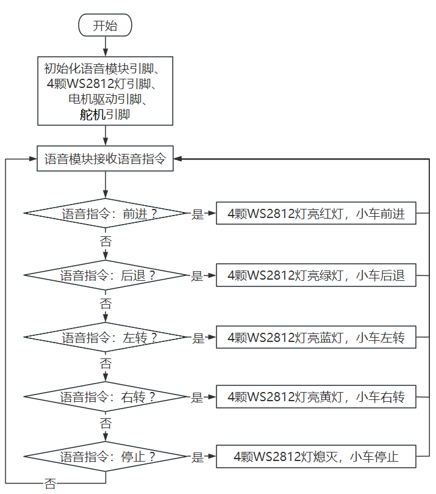
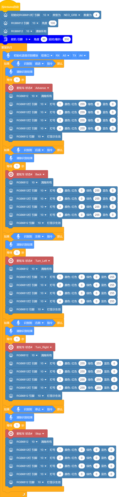
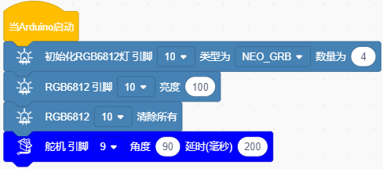
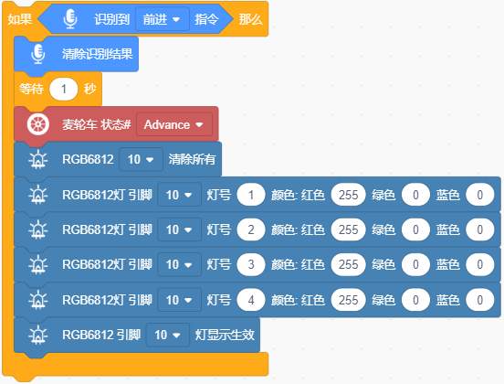
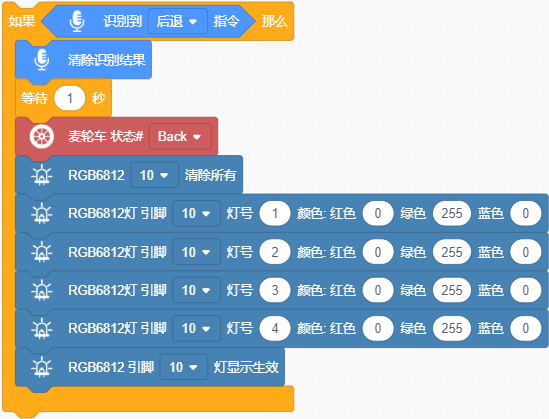
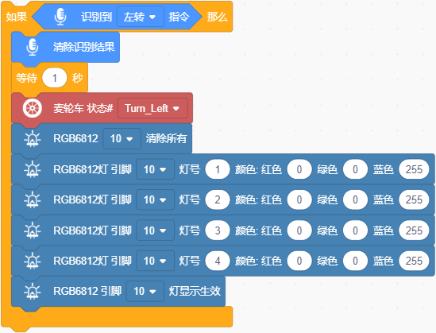
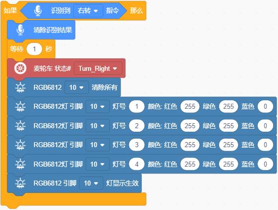

### 第6课 语音控制智能车运动

#### 6.1 课程介绍

想象一下，你不需要任何遥控器，只需对着空气说一声 “前进”，你的小车就会乖乖地向前跑去；说一声 “左转”，它就会灵活地原地旋转。这听起来像科幻电影里的场景，但在今天的课程中，我们将亲手实现它。语音控制不仅仅是智能家居的专利，在机器人领域，它能让交互变得更加自然和直观。

在前几节课中，我们已经学会了如何让语音模块识别指令，并点亮七彩灯或驱动舵机转动。今天，我们要挑战更复杂的任务：控制一辆智能小车，根据语音指令实现小车前进、后退、左转、右转和停止等动作，同时4颗WS2812灯珠亮对应的颜色灯。

#### 6.2 实验组件

| 元件名称 | 数量 | 图片 |
| :---: | :---: | :---: |
| 组装好的语音控制智能小车 (未插上蓝牙模块) | 1 |  |
| USB线     | 1    |   |
| 18650电池 | 2 |  |

#### 6.3 接线图

⚠️ **特别注意：语音控制智能小车已经组装好了，这里不需要把语音模块、控制七彩灯与4个电机、控制4颗WS2812灯珠的线材拆下来又重新接线，这里再次提供接线图，是为了方便您编写代码。**

| 语音模块 | 扩展板 | 
| :---: | :---: |
| **G** | G | 
| **V** | 5V | 
| **TXD** | A4 |
| **RXD** | A5 |

| 七彩灯与4个电机 | 扩展板 | 
| :---: | :---: |
| **GND** | D4 | 
| **5V** | D5 |
| **SDA** | D3 |
| **SCL** | D2 |

| 4 颗 WS2812 灯珠 | 扩展板 | 
| :---: | :---: |
| **GND** | G | 
| **5V** | 5V |
| **S4** | D10 | 

#### 6.4 流程图

#### 6.5 实验代码

⚠️ **特别提醒：语音控制智能小车已经组装好了。由于不需要用到蓝牙模块，那么在上传代码之前，请务必拔掉蓝牙模块。因为蓝牙模块也占用Arduino的串口通信（TX/RX），如果不拔掉，代码上传会失败！！**

#### 6.6 代码解释

- 定义4颗WS2812灯珠引脚为D10，灯珠数量为4，亮度为100，关闭所有灯珠；

- 设置舵机初始角度为90°。

- 初始化语音模块的软串口、引脚；

- 重复接收语音指令、读取语音指令且串口打印语音指令。

- 语音模块接收到 “前进” 等命令词时，小车执行 “前进” 动作，同时4颗WS2812灯珠亮红色灯；

- 语音模块接收到 “后退” 等命令词时，小车执行 “后退” 动作，同时4颗WS2812灯珠亮绿色灯；

- 语音模块接收到 “左转” 等命令词时，小车执行 “左转” 动作，同时4颗WS2812灯珠亮蓝色灯； 

- 语音模块接收到 “右转” 等命令词时，小车执行 “右转” 动作，同时4颗WS2812灯珠亮黄色灯；

- 语音模块接收到 “停止” 等命令词时，小车执行 “停止” 动作，同时4颗WS2812灯珠不亮；

#### 6.7 实验现象

⚠️ **重要提示：由于不需要用到蓝牙模块，那么在上传代码之前，请务必拔掉蓝牙模块。因为蓝牙模块也占用Arduino的串口通信（TX/RX），如果不拔掉，代码上传会失败！！**

外接电源，将电机驱动板上的拨码开关拨到 “ON” 端，上电后。选择好正确的设备（Mecanum Robot）和 适当的串口端口（COMxx），然后单击按钮上传代码至Arduino控制板。

代码上传成功后，然后对着语音模块上的麦克风，使用唤醒词 “你好，小智” 或 “小智小智” 来唤醒语音模块，同时喇叭播放回复语 “有什么可以帮到您”；

语音模块唤醒后，对着麦克风说：“前进” 等命令词时，喇叭播放对应的回复语 “正在前进”，同时小车前进，4颗WS2812灯珠亮红色灯；

对着麦克风说：“后退” 等命令词时，喇叭播放对应的回复语 “正在后退”，同时小车后退，4颗WS2812灯珠亮绿色灯；

对着麦克风说：“左转” 等命令词时，喇叭播放对应的回复语 “正在左转”，同时小车左转，4颗WS2812灯珠亮蓝色灯；

对着麦克风说：“右转” 等命令词时，喇叭播放对应的回复语 “正在右转”，同时小车右转，4颗WS2812灯珠亮黄色灯；

对着麦克风说：“停止” 等命令词时，喇叭播放对应的回复语 “已停止”，同时小车停止，4颗WS2812灯珠不亮。

