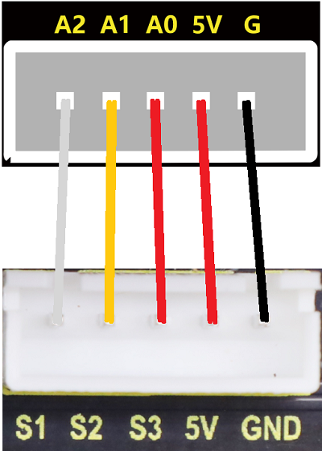

### 第7课 语音控制多功能智能车

#### 7.1 课程介绍

在前几节课中，我们已经分别学会了如何让小车“听”懂指令（语音识别）、如何“看”清周围（超声波测距）、如何“动”起来（舵机转向）、如何“亮”起来（WS2812灯效）以及如何“运动”起来（车轮子转起来）。但是，一个真正的4WD麦克纳姆轮智能小车不能只是孤立地执行单一任务，它需要将这些能力整合在一起，形成一个完整的系统。想象一下，如果你能对着一辆小车说“前进”，它就平稳前行；说“避障”，它就能自动躲避障碍物；说“请开灯”，车灯(七彩灯)就会随之闪烁；等多种功能。这就是我们今天要完成的终极挑战——构建一个多功能语音控制智能车。

#### 7.2 实验组件

| 元件名称 | 数量 | 图片 |
| :---: | :---: | :---: |
| 组装好的4WD麦克纳姆轮智能小车 (未插上蓝牙模块) | 1 |  |
| 智能语音识别模块             | 1    |  |
|HX2.54-4P 线材 (黑红白棕)|   1    |  |
| USB线     | 1    |   |
| 18650电池 | 2 |  |

#### 7.3 接线图

⚠️ 特别注意：4WD麦克纳姆轮智能小车已经组装好了，这里不需要把4WD麦克纳姆轮智能小车的线材拆下来又重新接线，这里再次提供接线图，是为了方便您编写代码！但是，语音识别模块是需要你自己接线的。

| 语音识别模块 |  扩展板 | 
| :---: | :---: |
| **GND** | G | 
| **V** | 5V | 
| **TXD** | A4 |
| **RXD** | A5 |

| 七彩灯与4个电机 |   扩展板 | 
| :---: | :---: |
| **GND** | D4 | 
| **5V** | D5 |
| **SDA** | D3 |
| **SCL** | D2 |

| 舵机 |  扩展板 | 
| :---: | :---: |
| **棕线** | G | 
| **红线** | 5V | 
| **橙线** | D9 |

| 4 颗 WS2812 全彩灯珠 |  扩展板 | 
| :---: | :---: |
| **GND** | G | 
| **5V** | 5V |
| **S4** | D10 |

| 超声波传感器 | 扩展板 | 
| :---: | :---: |
| **Vcc** | 5V | 
| **Trig** | D12 |
| **Echo** | D13 |
| **Gnd** | G |

| 三路循迹传感器 | 扩展板 | 
| :---: | :---: |
| **GND** | G | 
| **5V** | 5V |
| **S3** | A0 |
| **S2** | A1 |
| **S1** | A2 |

#### 7.4 实验代码

⚠️ **特别提醒：语音控制 4WD 麦克纳姆轮小车已经组装好了。由于不需要用到蓝牙模块，那么在上传代码之前，请务必拔掉蓝牙模块。因为蓝牙模块也占用Arduino的串口通信（TX/RX），如果不拔掉，代码上传会失败！！**

#### 7.5 实验现象

⚠️ **重要提示：由于不需要用到蓝牙模块，那么在上传代码之前，请务必拔掉蓝牙模块。因为蓝牙模块也占用Arduino的串口通信（TX/RX），如果不拔掉，代码上传会失败！！**

外接电源，将电机驱动板上的拨码开关拨到 “ON” 端，上电后。选择好正确的设备（Mecanum Robot）和 适当的串口端口（COMxx），然后单击按钮上传代码至Arduino控制板。

代码上传成功后，然后对着语音识别模块上的麦克风，使用唤醒词 “你好，小智” 或 “小智小智” 来唤醒语音识别模块，同时喇叭播放回复语 “有什么可以帮到您”；

语音识别模块唤醒后，对着麦克风说：“前进” 等命令词时，喇叭播放对应的回复语 “正在前进”，同时小车前进；

对着麦克风说：“后退” 等命令词时，喇叭播放对应的回复语 “正在后退”，同时小车后退；

对着麦克风说：“左转” 等命令词时，喇叭播放对应的回复语 “正在左转”，同时小车左转；

对着麦克风说：“右转” 等命令词时，喇叭播放对应的回复语 “正在右转”，同时小车右转；

对着麦克风说：“停止” 等命令词时，喇叭播放对应的回复语 “已停止”，同时小车停止；

对着麦克风说：“循迹” 等命令词时，喇叭播放对应的回复语 “循迹模式开启”，同时小车执行循迹功能；

对着麦克风说：“避障” 等命令词时，喇叭播放对应的回复语 “避障模式开启”，同时小车执行避障功能；

对着麦克风说：“跟随” 等命令词时，喇叭播放对应的回复语 “跟随模式开启”，同时小车执行跟随功能；

对着麦克风说：“左移” 等命令词时，喇叭播放对应的回复语 “正在左移”，同时小车左移；

对着麦克风说：“右移” 等命令词时，喇叭播放对应的回复语 “正在右移”，同时小车右移；

对着麦克风说：“左上移” 等命令词时，喇叭播放对应的回复语 “正在左上移”，同时小车左上移；

对着麦克风说：“左下移” 等命令词时，喇叭播放对应的回复语 “正在左下移”，同时小车左下移；

对着麦克风说：“右上移” 等命令词时，喇叭播放对应的回复语 “正在右上移”，同时小车右上移；

对着麦克风说：“右下移” 等命令词时，喇叭播放对应的回复语 “正在右上移”，同时小车右下移；

对着麦克风说：“左漂移” 等命令词时，喇叭播放对应的回复语 “正在左漂移”，同时小车左漂移；

对着麦克风说：“右漂移” 等命令词时，喇叭播放对应的回复语 “正在右漂移”，同时小车右漂移；

对着麦克风说：“请开灯” 等命令词时，喇叭播放对应的回复语 “已为您打开照明”，同时七彩灯点亮。

对着麦克风说：“请关灯” 等命令词时，喇叭播放对应的回复语 “已为您关闭照明”，同时七彩灯熄灭。

对着麦克风说：“打开红灯” 等命令词时，喇叭播放对应的回复语 “已为您打开红灯”，同时4颗WS2812全彩灯珠亮红色灯；

对着麦克风说：“关闭红灯” 等命令词时，喇叭播放对应的回复语 “已为您关闭红灯”，同时4颗WS2812全彩灯珠熄灭；

对着麦克风说：“打开绿灯” 等命令词时，喇叭播放对应的回复语 “已为您打开绿灯”，同时4颗WS2812全彩灯珠亮绿色灯；

对着麦克风说：“关闭绿灯” 等命令词时，喇叭播放对应的回复语 “已为您关闭绿灯”，同时4颗WS2812全彩灯珠熄灭；

对着麦克风说：“打开蓝灯” 等命令词时，喇叭播放对应的回复语 “已为您打开蓝灯”，同时4颗WS2812全彩灯珠亮蓝色灯；

对着麦克风说：“关闭蓝灯” 等命令词时，喇叭播放对应的回复语 “已为您关闭蓝灯”，同时4颗WS2812全彩灯珠熄灭；

对着麦克风说：“打开彩灯” 等命令词时，喇叭播放对应的回复语 “已为您打开彩灯”，同时4颗WS2812全彩灯珠亮彩色灯；

对着麦克风说：“关闭彩灯” 等命令词时，喇叭播放对应的回复语 “已为您关闭彩灯”，同时4颗WS2812全彩灯珠熄灭。