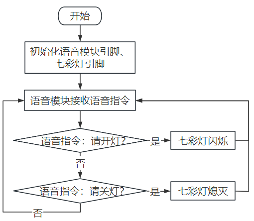
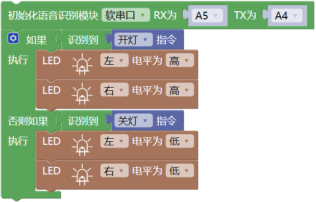
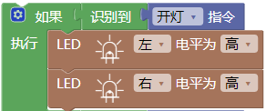
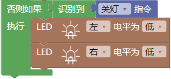

### 第2课 语音控制七彩灯

#### 2.1 课程介绍

使用语音模块接收到的语音指令来控制智能小车上的两个七彩灯，用户只需说出 “请开灯” 或 “请关灯” 等指令，系统便能快速响应，实现精准的本地化控制，可以使两个七彩灯闪烁或熄灭。这意味着以后你可以轻松地将语音控制功能添加到任何项目中，比如语音控制智能小车或语音播报距离。

#### 2.2 实验组件

| 元件名称 | 数量 | 图片 |
| :---: | :---: | :---: |
| 组装好的语音控制智能小车 (未插上蓝牙模块) | 1 |  |
| USB线     | 1    |   |
| 18650电池 | 2 |  |

#### 2.3 接线图

⚠️ **特别注意：语音控制智能小车已经组装好了，这里不需要把语音模块、控制七彩灯与4个电机的线材拆下来又重新接线，这里再次提供接线图，是为了方便您编写代码。**

| 语音模块 |扩展板 | 
| :---: | :---: |
| **G** | G | 
| **V** | 5V | 
| **TXD** | A4 |
| **RXD** | A5 |

| 七彩灯与4个电机 |扩展板 | 
| :---: | :---: |
| **GND** | D4 | 
| **5V** | D5 |
| **SDA** | D3 |
| **SCL** | D2 |

#### 2.4 流程图

#### 2.5 实验代码

⚠️ **特别提醒：语音控制智能小车已经组装好了。由于不需要用到蓝牙模块，那么在上传代码之前，请务必拔掉蓝牙模块。因为蓝牙模块也占用Arduino的串口通信（TX/RX），如果不拔掉，代码上传会失败！！**

#### 2.6 代码解释

- 初始化语音模块的软串口、引脚；

- 重复接收语音指令、读取语音指令且串口打印语音指令。

- 如果语音模块接收到 “请开灯” 等命令词时，七彩灯闪烁。

- 如果语音模块接收到 “请关灯” 等命令词时，七彩灯熄灭。

#### 2.7 实验现象

⚠️ **重要提示：由于不需要用到蓝牙模块，那么在上传代码之前，请务必拔掉蓝牙模块。因为蓝牙模块也占用Arduino的串口通信（TX/RX），如果不拔掉，代码上传会失败！！**

外接电源，将电机驱动板上的拨码开关拨到 “ON” 端，上电后。选择好正确的开发板板型（Arduino Uno）和 适当的串口端口（COMxx），然后单击按钮上传代码至Arduino控制板。

代码上传成功后，然后对着语音模块上的麦克风，使用唤醒词 “你好，小智” 或 “小智小智” 来唤醒语音模块，同时喇叭播放回复语 “有什么可以帮到您”；

语音模块唤醒后，对着麦克风说：“请开灯” 等命令词时，喇叭播放对应的回复语 “已为您打开照明”，同时七彩灯闪烁。

对着麦克风说：“请关灯” 等命令词时，喇叭播放对应的回复语 “已为您关闭照明”，同时七彩灯熄灭。

