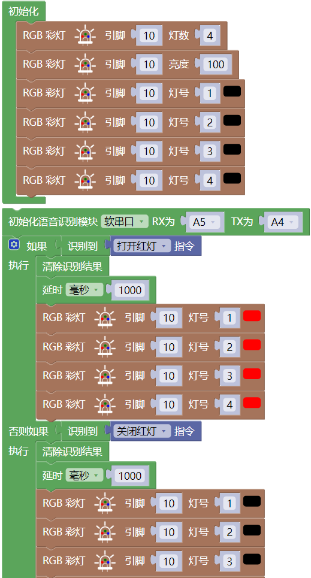
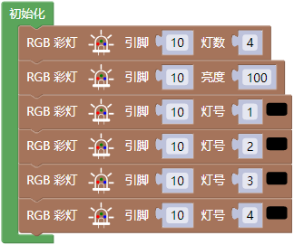
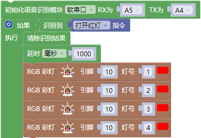

### 第3课 语音控制WS2812灯珠

#### 3.1 课程介绍

在本课中，我们将使用4WD麦克纳姆轮智能小车上的UNO PLUS主控板，搭配语音识别模块和小车底盘上集成的 4 颗 WS2812 全彩灯珠。通过语音识别模块接收到的语音指令来控制 4 颗 WS2812 灯珠同时亮起指定的颜色或熄灭。

#### 3.2 实验组件

| 元件名称 | 数量 | 图片 |
| :---: | :---: | :---: |
| 组装好的4WD麦克纳姆轮智能小车 (未插上蓝牙模块) | 1 |  |
| 语音识别模块             | 1    |  |
|HX2.54-4P 线材 (黑红白棕) |   1    |  |
| USB线     | 1    |   |
| 18650电池 | 2 |  |

#### 3.3 接线图

⚠️ 特别注意：4WD麦克纳姆轮智能小车已经组装好了，这里不需要把控制 4 颗 WS2812 全彩灯珠的线材拆下来又重新接线，这里再次提供接线图，是为了方便您编写代码！但是，语音识别模块是需要你自己接线的。

| 语音识别模块 | 扩展板 | 
| :---: | :---: |
| **GND** | G | 
| **V** | 5V | 
| **TXD** | A4 |
| **RXD** | A5 |

| 4 颗 WS2812 全彩灯珠 | 扩展板 | 
| :---: | :---: |
| **GND** | G | 
| **5V** | 5V |
| **S4** | D10 | 

#### 3.4 实验代码

⚠️ **特别提醒：语音控制 4WD 麦克纳姆轮小车已经组装好了。由于不需要用到蓝牙模块，那么在上传代码之前，请务必拔掉蓝牙模块。因为蓝牙模块也占用Arduino的串口通信（TX/RX），如果不拔掉，代码上传会失败！！**

#### 3.5 代码解释

- 定义4颗WS2812灯珠引脚为D10，灯珠数量为4，亮度为100，关闭所有灯珠。

- 初始化语音识别模块的软串口、引脚；

- 重复接收语音指令、读取语音指令且串口打印语音指令；

- 当语音识别模块接收到 “打开红灯” 等命令词时，4颗WS2812灯珠亮红色灯。

#### 3.6 实验现象

⚠️ **重要提示：由于不需要用到蓝牙模块，那么在上传代码之前，请务必拔掉蓝牙模块。因为蓝牙模块也占用Arduino的串口通信（TX/RX），如果不拔掉，代码上传会失败！！**

外接电源，将电机驱动板上的拨码开关拨到 “ON” 端，上电后。选择好正确的开发板板型（Arduino Uno）和 适当的串口端口（COMxx），然后单击按钮上传代码至Arduino控制板。

代码上传成功后，然后对着语音识别模块上的麦克风，使用唤醒词 “你好，小智” 或 “小智小智” 来唤醒智能语音模块，同时喇叭播放回复语 “有什么可以帮到您”；

语音识别模块唤醒后，对着麦克风说：“打开红灯” 等命令词时，喇叭播放对应的回复语 “已为您打开红灯”，同时4颗WS2812全彩灯珠亮红色灯；

对着麦克风说：“关闭红灯” 等命令词时，喇叭播放对应的回复语 “已为您关闭红灯”，同时4颗WS2812全彩灯珠熄灭；

对着麦克风说：“打开绿灯” 等命令词时，喇叭播放对应的回复语 “已为您打开绿灯”，同时4颗WS2812全彩灯珠亮绿色灯；

对着麦克风说：“关闭绿灯” 等命令词时，喇叭播放对应的回复语 “已为您关闭绿灯”，同时4颗WS2812全彩灯珠熄灭；

对着麦克风说：“打开蓝灯” 等命令词时，喇叭播放对应的回复语 “已为您打开蓝灯”，同时4颗WS2812全彩灯珠亮蓝色灯；

对着麦克风说：“关闭蓝灯” 等命令词时，喇叭播放对应的回复语 “已为您关闭蓝灯”，同时4颗WS2812全彩灯珠熄灭；

对着麦克风说：“打开彩灯” 等命令词时，喇叭播放对应的回复语 “已为您打开彩灯”，同时4颗WS2812全彩灯珠亮彩色灯；

对着麦克风说：“关闭彩灯” 等命令词时，喇叭播放对应的回复语 “已为您关闭彩灯”，同时4颗WS2812全彩灯珠熄灭。

