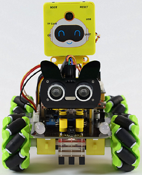
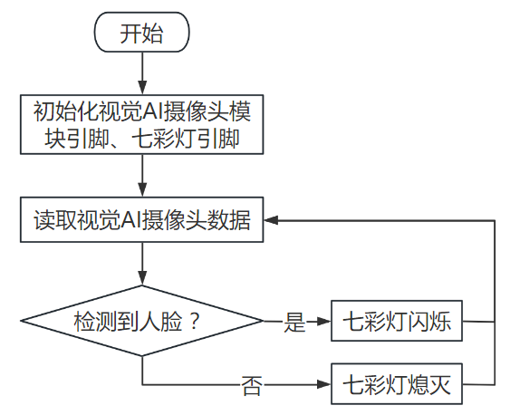
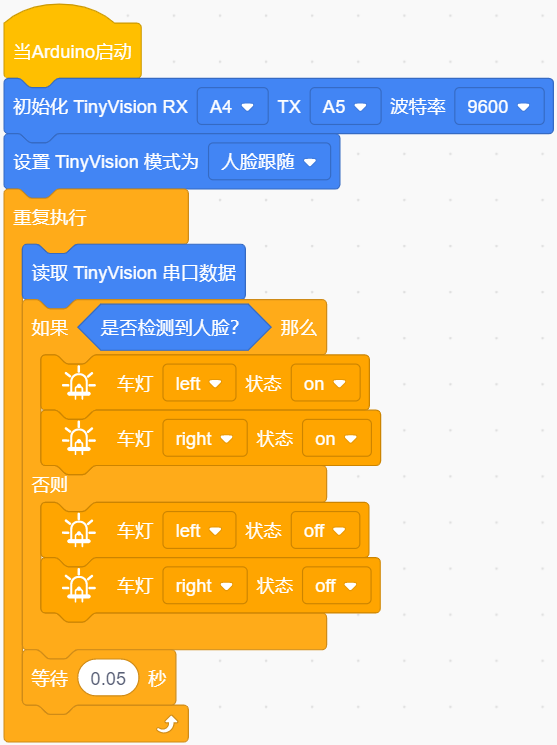
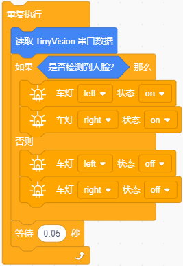
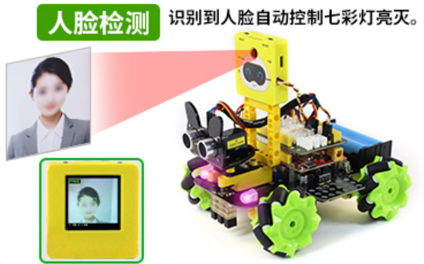

### 第1课 人脸检测

#### 1.1 课程介绍

这节课我们将使用智能小车与视觉AI摄像头模块搭配使用实现人脸检测功能；当识别到人脸时，智能小车上的两个七彩灯就闪烁，否则七彩灯不亮。

#### 1.2 实验组件

| 元件名称 | 数量 | 图片 |
| :---: | :---: | :---: |
|组装好的视觉AI摄像头控制智能小车 (未插上蓝牙模块) | 1 |  |
| USB线     | 1    |   |
| 18650电池 | 2 |  |

#### 1.3 接线图

⚠️ **特别注意：视觉AI摄像头控制智能小车已经组装好了，这里不需要把视觉AI摄像头模块、控制七彩灯与4个电机的线材拆下来又重新接线，这里再次提供接线图，是为了方便您编写代码。**

| 视觉AI摄像头模块（UART口） |  扩展板 | 
| :---: | :---: |
| **黑线（G）** | G | 
| **红线（V）** | 5V | 
| **橙线（TX）** | A4 |
| **白线（RX）** | A5 |

| 七彩灯与4个电机 |   扩展板 | 
| :---: | :---: |
| **GND** | D4 | 
| **5V** | D5 |
| **SDA** | D3 |
| **SCL** | D2 |

#### 1.4 流程图

#### 1.5 实验代码

⚠️ **特别提醒：视觉AI摄像头控制智能小车已经组装好了。由于不需要用到蓝牙模块，那么在上传代码之前，请务必拔掉蓝牙模块。因为蓝牙模块也占用Arduino的串口通信（TX/RX），如果不拔掉，代码上传会失败！！**

#### 1.6 代码说明

- 定义视觉AI摄像头模块的引脚TX接A4、RX接A5，设置波特率为9600；

- 启动视觉AI摄像头，并且切换模式为人脸跟随。

- 在无限循环中读取视觉串口数据，并且通过判断视觉AI摄像头是否检测到人脸。如果检测到了，那么两个七彩灯闪烁；否则，七彩灯不亮。

#### 1.7 实验结果  

⚠️ **重要提示：由于不需要用到蓝牙模块，那么在上传代码之前，请务必拔掉蓝牙模块。因为蓝牙模块也占用Arduino的串口通信（TX/RX），如果不拔掉，代码上传会失败！！**

外接电源，将电机驱动板上的拨码开关拨到 “ON” 端，上电后。选择好正确的设备（Mecanum Robot）和 适当的串口端口（COMxx），然后单击按钮上传代码至Arduino控制板。

代码上传成功后，当识别到人脸时，智能小车上的两个七彩灯闪烁，否则七彩灯不亮。

#### 1.8 常见问题

1\. 如果视觉AI摄像头模块屏幕闪烁，或智能车持续复位且无法正常工作：

- 解决方案：检查电池电量是否过低或电池质量是否不佳。电源可能已无法为智能车和视觉AI摄像头模块提供足够的电力。

