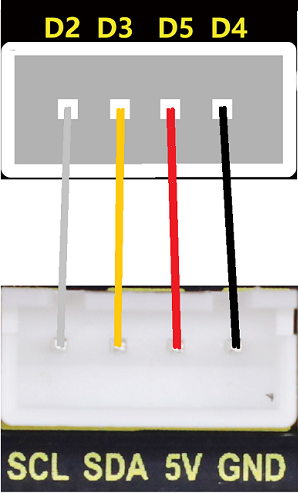
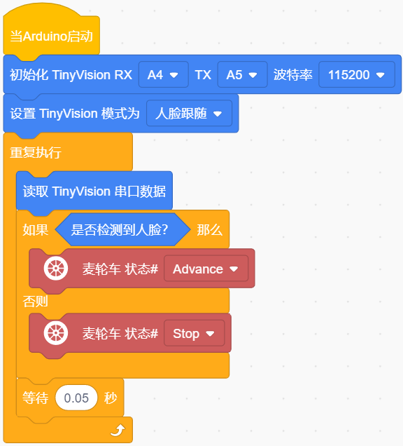
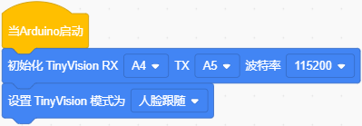
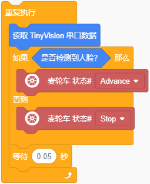

### 第4课 人脸跟随车

#### 4.1 简介

这节课我们将使用4WD 麦克纳姆轮小车与视觉AI摄像头搭配使用实现人脸跟随车功能；当识别到人脸时，4WD 麦克纳姆轮小车向前运动一段时间然后停止，否则小车停止不动。

#### 4.2 实验组件

| 元件名称 | 数量 | 图片 |
| :---: | :---: | :---: |
| 组装好的4WD麦克纳姆轮智能小车 (未插上蓝牙模块) | 1 |  |
| 视觉AI摄像头模块        | 1    |  |
|HX1.25-4P 线材 (黑红黄白) |   1    |  |
| 18650电池 | 2 |  |
| USB线     | 1    |   |

#### 4.3 接线图

⚠️ 特别注意：视觉AI摄像头控制4WD麦克纳姆轮智能小车已经组装好了，这里不需要把视觉AI摄像头4WD麦克纳姆轮智能小车的线材拆下来又重新接线，这里再次提供接线图，是为了方便您编写代码。

| 视觉AI摄像头模块（UART口） |  扩展板 | 
| :---: | :---: |
| **黑线（G）** | G | 
| **红线（V）** | 5V | 
| **橙线（TX）** | A4 |
| **白线（RX）** | A5 |

| 七彩灯与4个电机 | 扩展板 | 
| :---: | :---: |
| **GND** | D4 | 
| **5V** | D5 |
| **SDA** | D3 |
| **SCL** | D2 |

#### 4.4 实验代码

⚠️ **特别提醒：视觉AI摄像头控制4WD智能车已经组装好了。由于不需要用到蓝牙模块，那么在上传代码之前，请务必拔掉蓝牙模块。因为蓝牙模块也占用Arduino的串口通信（TX/RX），如果不拔掉，代码上传会失败！！**

#### 4.5 代码说明

- 定义视觉AI摄像头模块的引脚TX接A4、RX接A5，设置波特率为115200；

- 启动视觉AI摄像头，并且切换模式为人脸跟随。

- 在无限循环中读取视觉串口数据，并且通过判断视觉AI摄像头是否检测到人脸。如果检测到了，那么小车前进0.5秒然后停止；否则，小车停止不动。

#### 4.6 实验结果

⚠️ **重要提示：由于不需要用到蓝牙模块，那么在上传代码之前，请务必拔掉蓝牙模块。因为蓝牙模块也占用Arduino的串口通信（TX/RX），如果不拔掉，代码上传会失败！！**

外接电源，将电机驱动板上的拨码开关拨到 “ON” 端，上电后。选择好正确的设备（Mecanum Robot）和 适当的串口端口（COMxx），然后单击按钮上传代码至Arduino控制板。

代码上传成功后，当识别到人脸时，4WD 麦克纳姆轮小车一直跟着走，否则小车停止不动。
