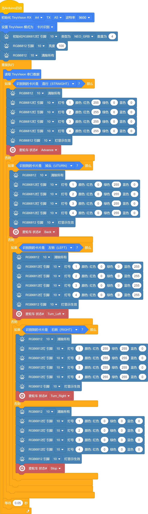
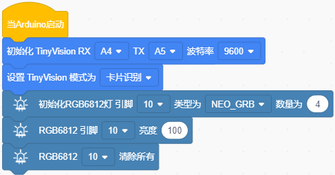
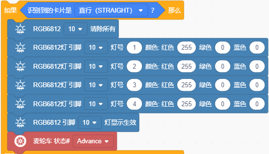
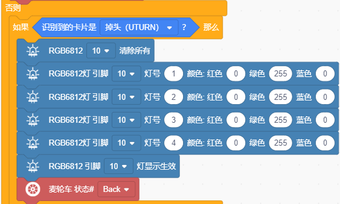
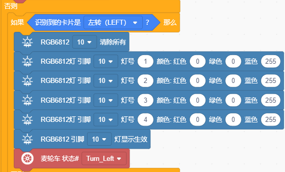
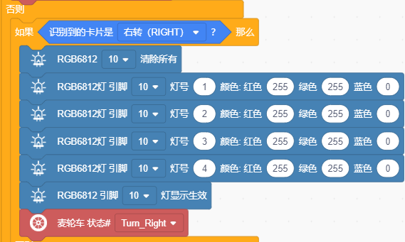
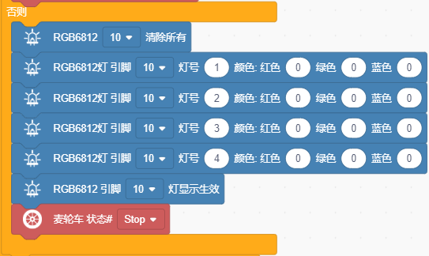

### 第5课 图标卡片识别

#### 5.1 简介

这节课我们使用4WD 麦克纳姆轮小车与视觉AI摄像头搭配使用实现使用实现图标卡片识别功能；当识别到什么图标卡片，4WD 麦克纳姆轮小车就会执行相应的动作。

#### 5.2 实验组件

| 元件名称 | 数量 | 图片 |
| :---: | :---: | :---: |
| 组装好的4WD麦克纳姆轮智能小车 (未插上蓝牙模块) | 1 |  |
| 视觉AI摄像头模块        | 1    |  |
|HX1.25-4P 线材 (黑红黄白) |   1    |  |
| USB线     | 1    |   |
| 18650电池 | 2 |  |
| 图标卡片 |5||

#### 5.3 接线图

⚠️ 特别注意：视觉AI摄像头控制4WD麦克纳姆轮智能小车已经组装好了，这里不需要把视觉AI摄像头4WD麦克纳姆轮智能小车的线材拆下来又重新接线，这里再次提供接线图，是为了方便您编写代码。

| 视觉AI摄像头模块（UART口） |  扩展板 | 
| :---: | :---: |
| **黑线（G）** | G | 
| **红线（V）** | 5V | 
| **橙线（TX）** | A4 |
| **白线（RX）** | A5 |

| 七彩灯与4个电机 | 扩展板 | 
| :---: | :---: |
| **GND** | D4 | 
| **5V** | D5 |
| **SDA** | D3 |
| **SCL** | D2 |

| 4 颗 WS2812 全彩灯珠 | 扩展板 | 
| :---: | :---: |
| **GND** | G | 
| **5V** | 5V |
| **S4** | D10 | 

#### 5.4 实验代码

⚠️ **特别提醒：视觉AI摄像头控制 4WD 麦克纳姆轮小车已经组装好了。由于不需要用到蓝牙模块，那么在上传代码之前，请务必拔掉蓝牙模块。因为蓝牙模块也占用Arduino的串口通信（TX/RX），如果不拔掉，代码上传会失败！！**

#### 5.5 代码说明

- 定义视觉AI摄像头模块的引脚TX接A4、RX接A5，设置波特率为115200；

- 启动视觉AI摄像头，并且切换模式为卡片识别；

- 定义4颗WS2812灯珠引脚接D10，灯珠数量为4，亮度为100，4颗WS2812灯珠熄灭。

- 在无限循环中读取视觉AI摄像头串口数据。

- 通过判断如果检测到直行图标卡片，那么小车前进，4颗WS2812灯珠亮红色灯。

- 通过判断如果检测到掉头图标卡片，那么小车后退，4颗WS2812灯珠亮绿色灯。

- 通过判断如果检测到左转图标卡片，那么小车左转，4颗WS2812灯珠亮蓝色灯。

- 通过判断如果检测到右转图标卡片，那么小车右转，4颗WS2812灯珠亮黄色灯。

- 通过判断如果未检测到任何图标卡片，那么4颗WS2812灯珠不亮，小车停止不动。

#### 5.6 实验结果

⚠️ **重要提示：由于不需要用到蓝牙模块，那么在上传代码之前，请务必拔掉蓝牙模块。因为蓝牙模块也占用Arduino的串口通信（TX/RX），如果不拔掉，代码上传会失败！！**

外接电源，将电机驱动板上的拨码开关拨到 “ON” 端，上电后。选择好正确的设备（Mecanum Robot）和 适当的串口端口（COMxx），然后单击按钮上传代码至Arduino控制板。

代码上传成功后，将图标卡片放在摄像头前，当使用直行图标卡片时，小车会向前行驶，4颗WS2812灯珠亮红色灯；当使用掉头图标卡片时，小车会后退，4颗WS2812灯珠亮绿色灯；当使用左转图标卡片时，小车会左转，4颗WS2812灯珠亮蓝色灯；当使用右转图标卡片时，小车会右转，4颗WS2812灯珠亮黄色灯；当未检测到任何图标卡片时，小车停止不动，4颗WS2812灯珠不亮。
