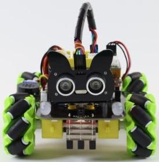
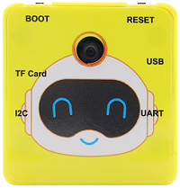
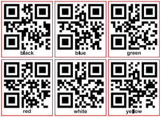
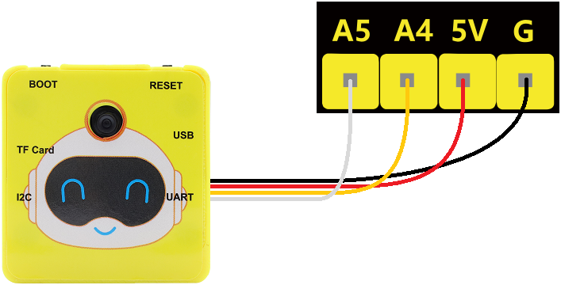
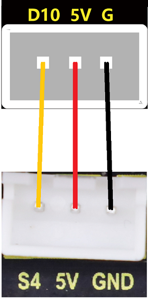

### 第2课 二维码识别

#### 2.1 课程介绍

这节课我们将使用 4WD 麦克纳姆轮小车与视觉AI摄像头搭配使用实现二维码识别功能；当识别到什么二维码，4WD 麦克纳姆轮小车上的4颗 WS2812灯珠就会显示对应颜色。

#### 2.2 实验组件

| 元件名称 | 数量 | 图片 |
| :---: | :---: | :---: |
| 组装好的4WD麦克纳姆轮智能小车<br>(<span style="color: rgb(255, 76, 65);">未插上蓝牙模块</span>) | 1 |  |
| 视觉AI摄像头模块        | 1    |  |
|HX1.25-4P 线材 (黑红黄白) |   1    |  |
| 18650电池 | 2 |  |
| USB线     | 1    |   |
|二维码卡片|6||


#### 2.3 接线图

⚠️ 特别注意：视觉AI摄像头控制4WD麦克纳姆轮智能小车已经组装好了，这里不需要把视觉AI摄像头4WD麦克纳姆轮智能小车的线材拆下来又重新接线，这里再次提供接线图，是为了方便您编写代码。

| 视觉AI摄像头模块（UART口） |  扩展板 | 
| :---: | :---: |
| **黑线（G）** | G | 
| **红线（V）** | 5V | 
| **橙线（TX）** | A4 |
| **白线（RX）** | A5 |



| 4 颗 WS2812 全彩灯珠 | 扩展板 | 
| :---: | :---: |
| **GND** | G | 
| **5V** | 5V |
| **S4** | D10 | 



#### 2.4 实验代码

⚠️ <span style="color:red;">**特别提醒：视觉AI摄像头控制 4WD 麦克纳姆轮小车已经组装好了。由于不需要用到蓝牙模块，那么在上传代码之前，请务必拔掉蓝牙模块。因为蓝牙模块也占用Arduino的串口通信（TX/RX），如果不拔掉，代码上传会失败！！**</span>

```c
// 导入库文件
#include <Arduino.h>
#include "AiCam.h"
#include <Adafruit_NeoPixel.h>
#ifdef __AVR__
 #include <avr/power.h> // 需要 16 MHz Adafruit 固件
#endif

const int LED_PIN = 10;  // 定义4颗WS2812灯珠的引脚
const int LED_COUNT = 4; // 新像素数
Adafruit_NeoPixel strip(LED_COUNT, LED_PIN, NEO_GRB + NEO_KHZ800);

AiCam aiCam(A4, A5); // 定义引脚: TX接A4, RX接A5

void setup() {
   Serial.begin(115200); // 设置波特率
   aiCam.begin(); // 启动视觉AI摄像头
   
   aiCam.setAiCamMode("qr"); // 设置视觉AI摄像头为二维码识别模式
  
   #if defined(__AVR_ATtiny85__) && (F_CPU == 16000000)
      clock_prescale_set(clock_div_1);
   #endif
   strip.begin();           // 初始化新像素条
   strip.show();            // 关闭所有像素
   strip.setBrightness(100); // 设置亮度（最大255）
   colorWipe(strip.Color(0, 0, 0), 50); // 熄灭4颗WS2812灯珠
}

void loop() {
   aiCam.readEspSerial(); // 持续读取摄像头串口数据，刷新识别缓存
   // 根据不同二维码执行对应逻辑
   if ((String(aiCam.getQrCode()) == "red")) {
      colorWipe(strip.Color(255, 0, 0), 50); // 亮红色灯
   } else if ((String(aiCam.getQrCode()) == "green")) {
      colorWipe(strip.Color(0, 255, 0), 50);  // 亮绿色灯
   } else if ((String(aiCam.getQrCode()) == "blue")) {
      colorWipe(strip.Color(0, 0, 255), 50);  // 亮蓝色灯
   } else if ((String(aiCam.getQrCode()) == "yellow")) {
      colorWipe(strip.Color(255, 255, 0), 50); // 亮黄色灯
   } else if ((String(aiCam.getQrCode()) == "white")) {
      colorWipe(strip.Color(255, 255, 255), 50); // 亮黄色灯
   } else if ((String(aiCam.getQrCode()) == "black")) {
      colorWipe(strip.Color(0, 0, 0), 50); // 熄灭
   }
   delay(1000); // 防抖延时，避免反复快速识别
}

// 用一种颜色填充灯带
void colorWipe(uint32_t color, int wait) {
  for(int i=0; i<strip.numPixels(); i++) { 
    strip.setPixelColor(i, color); // 设置像素颜色
    strip.show();                  // 更新灯带
    delay(wait);                   // 暂停
  }
}
```

#### 2.5 代码说明

1\. 导入库文件和引脚定义

```c
#include <Arduino.h>
#include "AiCam.h"
#include <Adafruit_NeoPixel.h>
#ifdef __AVR__
 #include <avr/power.h> 
#endif

AiCam aiCam(A4, A5); 

const int LED_PIN = 10;  
const int LED_COUNT = 4; 
Adafruit_NeoPixel strip(LED_COUNT, LED_PIN, NEO_GRB + NEO_KHZ800);
```
- 导入相关的库文件，定义视觉AI摄像头模块的引脚TX接A4，RX接A5；定义4颗WS2812灯珠引脚接D10

2\. setup()初始化函数 

```c
void setup() {
   Serial.begin(115200); 
   aiCam.begin(); 
   
   aiCam.setAiCamMode("qr"); 
  
   #if defined(__AVR_ATtiny85__) && (F_CPU == 16000000)
      clock_prescale_set(clock_div_1);
   #endif
   strip.begin();          
   strip.show();            
   strip.setBrightness(100); 
   colorWipe(strip.Color(0, 0, 0), 50); 
}
```
- 初始化波特率为115200，启动视觉AI摄像头，并且切换模式为二维码识别；

- 初始化4颗WS2812的像数和亮度。

3\. loop()主循环函数

```c
aiCam.readEspSerial(); 
```
- 在无限循环中读取视觉AI摄像头串口数据。

```c
if ((String(aiCam.getQrCode()) == "red")) {
    colorWipe(strip.Color(255, 0, 0), 50); 
}
```
- 通过判断如果识别为 "red" 二维码，那么4颗WS2812灯珠亮红色灯。

```c
else if ((String(aiCam.getQrCode()) == "green")) {
    colorWipe(strip.Color(0, 255, 0), 50); 
}
```
- 通过判断如果识别为 "green" 二维码，那么4颗WS2812灯珠亮绿色灯。

```c
else if ((String(aiCam.getQrCode()) == "blue")) {
    colorWipe(strip.Color(0, 0, 255), 50); 
}
```
- 通过判断如果识别 "blue" 二维码，那么4颗WS2812灯珠亮蓝色灯。

```c
else if ((String(aiCam.getQrCode()) == "yellow")) {
    colorWipe(strip.Color(255, 255, 0), 50); 
}
```
- 通过判断如果识别为 "yellow" 二维码，那么4颗WS2812灯珠亮黄色灯。

```c
else if ((String(aiCam.getQrCode()) == "white")) {
    colorWipe(strip.Color(255, 255, 255), 50); 
}
```
- 通过判断如果识别为 "white" 二维码，那么4颗WS2812灯珠亮白色灯。

```c
else if ((String(aiCam.getQrCode()) == "black")) {
      colorWipe(strip.Color(0, 0, 0), 50); 
}
```
- 通过判断如果识别为 "black" 二维码，那么4颗WS2812灯珠亮不亮。

```c
void colorWipe(uint32_t color, int wait) {
  for(int i=0; i<strip.numPixels(); i++) { 
    strip.setPixelColor(i, color); 
    strip.show();                  
    delay(wait);                   
  }
}
```
- 用一种颜色填充灯带。

#### 2.6 实验结果

⚠️ <span style="color:red;">**重要提示：由于不需要用到蓝牙模块，那么在上传代码之前，请务必拔掉蓝牙模块。因为蓝牙模块也占用Arduino的串口通信（TX/RX），如果不拔掉，代码上传会失败！！**</span>

外接电源，将电机驱动板上的拨码开关拨到 “<span style="color: rgb(255, 76, 65);">ON</span>” 端，上电后。选择好正确的开发板板型（Arduino Uno）和 适当的串口端口（COMxx），然后单击按钮上传代码至Arduino控制板。

代码上传成功后，将二维码卡片放在摄像头前，当使用 **red** 二维码卡片时，小车的4颗 WS2812灯珠会亮起红色灯；当使用 **green** 二维码卡片时，小车的4颗 WS2812灯珠会亮起绿色灯；当使用 **blue** 二维码卡片时，小车的4颗 WS2812灯珠会亮起蓝色灯；当使用 **yellow** 二维码卡片时，小车的4颗 WS2812灯珠会亮起黄色灯；当使用 **white** 二维码卡片时，小车的4颗 WS2812灯珠会亮起白色灯；当使用 **black** 二维码卡片时，小车的4颗 WS2812灯珠会熄灭。


