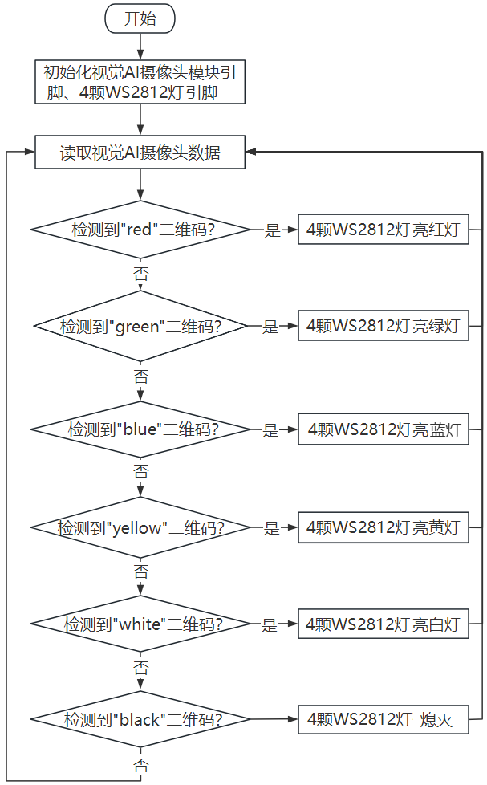
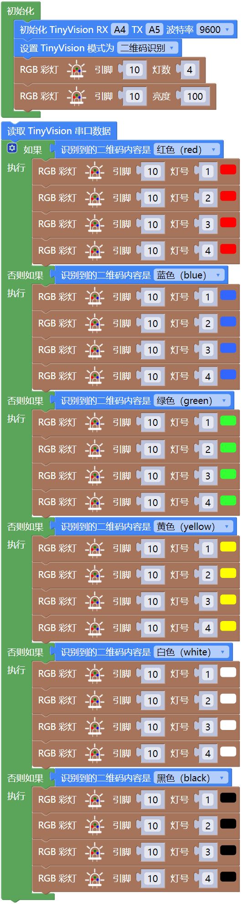
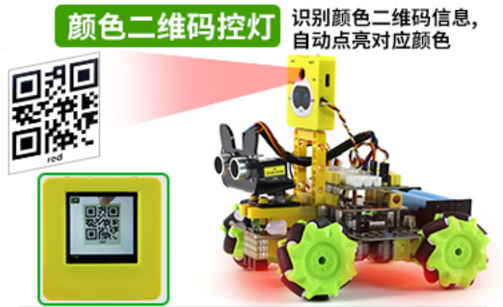

### 第2课 二维码识别

#### 2.1 课程介绍

这节课我们将使用智能小车与视觉AI摄像头搭配使用实现二维码识别功能；当识别到什么二维码，智能小车上的4颗 WS2812灯珠就会显示对应颜色。

#### 2.2 实验组件

| 元件名称 | 数量 | 图片 |
| :---: | :---: | :---: |
|组装好的视觉AI摄像头控制智能小车 (未插上蓝牙模块) | 1 |   |
| 18650电池 | 2 |  |
|   USB线   | 1    |   |
|二维码卡片|6||

#### 2.3 接线图

⚠️ **特别注意：视觉AI摄像头控制智能小车已经组装好了，这里不需要把视觉AI摄像头模块与控制4颗WS2812灯珠的线材拆下来又重新接线，这里再次提供接线图，是为了方便您编写代码。**

| 视觉AI摄像头模块（UART口） |  扩展板 | 
| :---: | :---: |
| **黑线（G）** | G | 
| **红线（V）** | 5V | 
| **橙线（TX）** | A4 |
| **白线（RX）** | A5 |

| 4 颗 WS2812 灯珠 | 扩展板 | 
| :---: | :---: |
| **GND** | G | 
| **5V** | 5V |
| **S4** | D10 | 

#### 2.4 流程图

#### 2.5 实验代码

⚠️ **特别提醒：视觉AI摄像头控制智能小车已经组装好了。由于不需要用到蓝牙模块，那么在上传代码之前，请务必拔掉蓝牙模块。因为蓝牙模块也占用Arduino的串口通信（TX/RX），如果不拔掉，代码上传会失败！！**

#### 2.6 代码说明

- 定义视觉AI摄像头模块的引脚TX接A4、RX接A5，设置波特率为9600；

- 启动视觉AI摄像头，并且切换模式为二维码识别；

- 定义4颗WS2812灯珠引脚接D10，灯珠数量为4，亮度为100，4颗WS2812灯珠熄灭。

- 在无限循环中读取视觉AI摄像头串口数据。

- 通过判断如果识别为 "red" 二维码，那么4颗WS2812灯珠亮红色灯。

- 通过判断如果识别为 "green" 二维码，那么4颗WS2812灯珠亮绿色灯。

- 通过判断如果识别 "blue" 二维码，那么4颗WS2812灯珠亮蓝色灯。

- 通过判断如果识别为 "yellow" 二维码，那么4颗WS2812灯珠亮黄色灯。

- 通过判断如果识别为 "white" 二维码，那么4颗WS2812灯珠亮白色灯。

- 通过判断如果识别为 "black" 二维码，那么4颗WS2812灯珠亮不亮。

#### 2.7 实验结果

⚠️ **重要提示：由于不需要用到蓝牙模块，那么在上传代码之前，请务必拔掉蓝牙模块。因为蓝牙模块也占用Arduino的串口通信（TX/RX），如果不拔掉，代码上传会失败！！**

外接电源，将电机驱动板上的拨码开关拨到 “ON” 端，上电后。选择好正确的开发板板型（Arduino Uno）和 适当的串口端口（COMxx），然后单击按钮上传代码至Arduino控制板。

代码上传成功后，将二维码卡片放在摄像头前，当使用 **red** 二维码卡片时，小车的4颗 WS2812灯珠会亮起红色灯；当使用 **green** 二维码卡片时，小车的4颗 WS2812灯珠会亮起绿色灯；当使用 **blue** 二维码卡片时，小车的4颗 WS2812灯珠会亮起蓝色灯；当使用 **yellow** 二维码卡片时，小车的4颗 WS2812灯珠会亮起黄色灯；当使用 **white** 二维码卡片时，小车的4颗 WS2812灯珠会亮起白色灯；当使用 **black** 二维码卡片时，小车的4颗 WS2812灯珠会熄灭。

